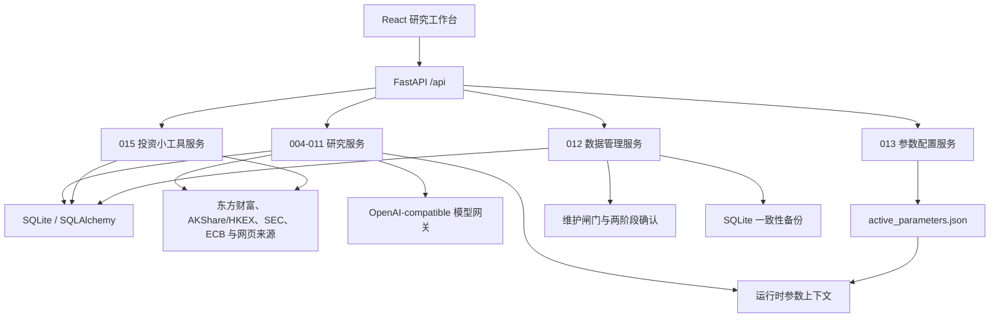
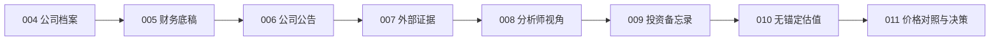

# 001_价值投资分析师系统架构

## 产品定位

系统是一个本地优先、证据驱动、可追溯的价值投资研究工作台。它从公司资料和原始证据出发，经过财务底稿、公告、外部证据、多分析师视角、投资备忘录和无价格锚定估值，最后才结合市场价格生成决策参考。

系统不替代研究者，不连接券商账户，也不执行交易。015 只保存人工录入的持仓数量并派生组合估值；模型输出必须经过结构校验、来源约束和人工复核，评分、估值及价格决策尽量由后端确定性公式完成。

## 当前总体架构

- 前端：React 19、TypeScript、Vite、Lucide。
- API：FastAPI + Pydantic，统一前缀 `/api`。
- 持久化：SQLite + SQLAlchemy，启动时执行建表、轻量迁移和公司种子同步。
- 外部数据：东方财富 A 股数据、固定版本 AKShare 与 HKEXnews 港股数据、SEC EDGAR/Company Facts 美股数据、ECB 日参考汇率，以及网页搜索和正文抓取。
- 智能分析：统一模型网关，结构化结果通过 Pydantic 和业务规则双重校验。
- 参数配置：唯一生效源码为 `backend/app/configuration/active_parameters.json`，缺失或损坏时整包回退内置默认值。
- 运维数据：数据库备份默认位于 `data/backups/`；参数源码文件不属于 SQLite 备份。

## 当前前端信息架构

左侧导航当前全部使用中文，共 13 个入口：

1. 概览
2. 公司搜索
3. 公司工作台
4. 财务底稿
5. 公司公告
6. 外部证据
7. 分析师视角
8. 投资备忘录
9. 估值实验室
10. 价格决策
11. 投资小工具
12. 参数配置
13. 数据管理

其中 004-011 是 `8 / 8` 研究主链路；012、013 和 015 是独立系统能力，不计入主链路完成度。015 内部通过工具注册表提供“持仓组合”“买入备忘录”和“市场温度”三个 Tab，不依赖当前研究公司。买入备忘录只导入并冻结用户选定的历史 011 结果摘要，不回写或重算 011。当前公司选择保存在 React 会话内，搜索词、分页和返回滚动位置可以恢复，但浏览器整页刷新后不会保留当前研究对象。

## 已实现研究主链路

| 模块 | 当前已实现职责 | 主要持久化对象 |
| --- | --- | --- |
| 004 | 发行人搜索、新增、Listing 选择、能力状态、档案与不可变行情刷新 | `Company`、`SecurityListing`、`MarketSnapshot` |
| 005 | 四类财务报表、按报告期展示、确定性财务证据包 | `FinancialStatement` |
| 006 | 公告同步、正文读取、快速摘要、深度摘要和复核 | `Announcement` |
| 007 | 外部搜索、网页正文提取、手工文本导入、证据筛选与诊断 | `Evidence`、`AnalysisRun` |
| 008 | 8 个固定分析师 Profile、32 条规则、事实账本和价格盲区规则矩阵 | `AnalysisRun` |
| 009 | 委员会叙事综合、来源图和 Memo 版本 | `InvestmentMemo`、`AnalysisRun` |
| 010 | 32 条规则聚合、动态安全边际、参数确认和五模型三情景内在价值 | `ValuationRun` |
| 011 | 读取已确认 010 的冻结安全边际，按 Listing/FX/证券单位执行价格对照 | `PriceDecisionRun`、`MarketSnapshot`、`FxRateSnapshot` |

### 主链路数据流

1. 004 建立发行人及其 Listing 身份，按所选 Listing 维护档案、能力状态和不可变行情快照；Company 旧证券字段只同步主 Listing 镜像。
2. 005、006、007 分别形成财务底稿、官方公告和外部证据；007 既支持自动搜索，也支持手工文本导入。
3. 008 从财务、公告和外部证据构建递归净化的价格隔离快照，按固定顺序运行 8 个 Profile、每人 4 条规则；模型输出一旦含价格锚即整次失败。
4. 009 选择至少 2 个 Profile 的最新成功运行，生成确定性委员会账本和纯叙事、可追溯 Memo；不输出评分、权重或安全边际。
5. 010 要求 8 个 Profile 的最新一次运行全部成功且各有精确 4 条规则，聚合 32 条规则并计算动态安全边际；用户确认参数后执行五种确定性估值模型，并冻结公式、权重、贡献和配置快照。
6. 011 绑定已经完成的 010 估值及其固定 Memo，最后才读取目标 Listing 的不可变行情和必要 FX，按发行人每股价值 × Listing 单位比率 × 汇率换算后计算三情景买入价、当前安全边际和价格状态。

## 已实现系统能力

### 012 数据管理

012 是独立 SQLite 运维面，已经实现：

- 只清空某家公司的研究数据并保留发行人档案、全部 Listing、不可变行情快照和共享 FX 快照；预览会列出这些受保护记录。
- 保留公司及采集资料，只清空全部分析、Memo、估值和价格决策历史。
- 按公司或全局只保留最近 `N` 个版本，并保护 latest、归档及被引用记录。
- 物理清理可安全删除的软删除记录，执行完整性检查、`VACUUM` 和 `ANALYZE`。
- 手动备份、自动备份、保留数量、备份校验、恢复和删除。
- 完整初始化数据库，并在操作前自动创建可恢复备份。
- Preview/Execute 两阶段协议、十分钟一次性令牌、精确确认短语和维护闸门。

### 013 参数配置

013 是 004-011 的统一配置面，当前覆盖八个域：数据采样、财务预警、市场数据、分析师引擎、估值规则矩阵、Memo 决策、估值模型和价格决策。

- 页面编辑只保存在浏览器内存，未发布修改刷新后丢失。
- 校验不写文件；发布经完整校验和警告确认后原子覆盖唯一参数 JSON。
- 当前没有草稿、配置版本、发布历史或回滚流程。
- 新生成的 008-011 运行保存 `config_hash` 和完整 `config_snapshot`；后续发布不会追溯改变历史结果。
- `ParameterConfigVersion` 仅作为旧数据库兼容表保留，当前配置流程不再读写。
- price-blind、会计基础定义、规则角色和历史不可变性等结构性约束固定在代码中，不能通过配置关闭。

### 015 投资小工具

015 是独立持久化模块，首版包含按具体 `SecurityListing` 记录证券数量的历史持仓快照，以及 A 股 50ETF QVIX、港股 VHSI、美股 VIX 的日频市场温度。组合金额和权重只按最新可用 `MarketSnapshot` 与 `FxRateSnapshot` 即时派生；价格或汇率缺失时标记未计价，不进入分母。市场温度按各自过去三年历史百分位映射，不直接比较不同指数的绝对值。

015 复用 014 的 Listing、行情 Provider 与 ECB FX 服务，但不读取或改写 008-011 的运行、估值和决策结果。数据管理中的 research cleanup 保留 015；只有经过预览、确认和备份的完整初始化会删除 015 数据。

## 当前核心数据模型

| 实体 | 主要用途 | 生命周期要点 |
| --- | --- | --- |
| `Company` | 发行人级研究根与身份事实 | 保留全部既有 company_id；旧 ticker/exchange/行情字段仅作主 Listing 兼容镜像 |
| `SecurityListing` | 同一发行人的上市证券 | 明确市场、交易币种、证券类型、主 Listing 与每单位对应普通股数 |
| `MarketSnapshot` | Listing 级行情事实 | 每次刷新新建、禁止更新或删除；新 011 必须绑定 |
| `FxRateSnapshot` | 币种方向与日参考汇率 | 每次刷新新建、禁止更新或删除；v6 保存交叉汇率计算审计 |
| `FinancialStatement` | 多市场原始财务底稿 | 明确期间、币种、准则、表单、taxonomy、修订与来源审计 |
| `Announcement` | A 股公告、HKEX/SEC 披露与当前摘要 | 可绑定 Listing，保留语言、文档/表单类型和正文抓取审计 |
| `Evidence` | 外部证据、评分、复核和原始快照 | 自动搜索和手工导入共用 |
| `AnalysisRun` | 搜索、导入、分析师和 Memo 生成运行 | 保存输入、结果及参数快照 |
| `InvestmentMemo` | 投资备忘录版本 | 支持 latest、归档、软删除和来源链 |
| `ValuationRun` | 无锚定估值草稿与计算结果 | 冻结 valuation currency/share basis；重算创建新记录 |
| `PriceDecisionRun` | 估值与目标 Listing 的价格对照版本 | 冻结估值/Memo/行情/可选 FX、币种、比率与公式，支持软删除 |
| `PortfolioOwner` | 015 持仓人身份 | 存在快照时拒绝删除；持久化用户目录顺序 |
| `PortfolioSnapshot` | 015 特定披露/统计日期的组合 | 基准币种为 CNY/HKD/USD；不同日期独立保存并支持持久化排序 |
| `PortfolioHolding` | 015 快照内具体 Listing 的证券数量 | 同快照 Listing 唯一，数量为 8 位小数定点数 |
| `MarketFearSnapshot` | 015 三市场温度的最近成功缓存 | 上游失败保留旧记录并标记过期 |

系统使用稳定 `Company.canonical_key` 识别发行人，`SecurityListing.exchange + ticker` 唯一识别上市证券。同一 Company 可以拥有多个 Listing；切换主 Listing 只原子更新兼容镜像，不迁移财务、证据、008-010 或改写旧 011。

## 当前市场支持边界

首轮支持 A 股、港交所普通股及 NASDAQ/NYSE/AMEX 普通股/ADS。标准测试使用离线 fixture；真实来源只由显式 smoke 命令访问。

| 能力 | A 股 | 港股 | 美股 | 当前说明 |
| --- | --- | --- | --- | --- |
| 发行人、Listing、搜索与能力状态 | 已支持 | 已支持 | 已支持 | Company 发行人根、Listing 选择和 Provider capability 统一 |
| 不可变行情快照 | 已支持 | 已支持 | 已支持 | Listing 明确 CNY/HKD/USD；每次刷新新建快照 |
| 公司档案 | 东方财富 | 固定版本 AKShare | SEC submissions/ticker/CIK | capability 不可用时给出原因和修复项 |
| 结构化财务与分红 | 东方财富四表/分红 | AKShare 港股三表、指标、分红 | SEC Company Facts 标准 taxonomy | 统一期间、币种、会计准则、表单和映射诊断 |
| 官方披露与正文 | 东方财富公告 | HKEXnews PDF | SEC submissions/Archives HTML/XBRL | 保留文档 ID、语言、表单、来源和抓取审计 |
| 外部证据 | A 股官方/政府来源 | HKEX/SFC/IR/香港政府 | SEC/IR/美国政府与监管来源 | 港美 fallback 不生成 SSE/CNInfo 线索 |
| 008-010 | 已支持 | 已支持 | 已支持 | 动态金额/币种上下文，仍严格 price-blind |
| 011 Listing/FX/证券单位换算 | 已支持 | 已支持 | 已支持 | ECB 日参考汇率；缺失/过期行情、FX 或 ADS 比率即阻断 |
| 015 持仓组合估值 | 已支持 | 已支持 | 已支持 | 按具体 Listing 的实际证券数量计价；ADS 不乘换算比例，缺价格/FX 则未计价 |
| 015 市场温度 | 50ETF QVIX 代理 | VHSI | VIX | 最新日频收盘及各自 3 年历史百分位；不比较绝对值 |

## 不可破坏的架构边界

- **价格隔离**：004 可以保存行情，但 008、009、010 的模型输入和计算必须清除当前价、市值、目标价、估值倍数和交易动作；价格只在 011 进入。
- **确定性计算**：财务指标、规则评分、估值、敏感性和价格区间由后端公式计算；模型只负责受约束的结构化研究判断和参数建议。
- **历史可复现**：009-011 不回溯替换已绑定来源；008-011 保存输入或参数快照，重算创建新版本。
- **缺失不猜测**：数据缺口必须进入结果、置信度或诊断，不能用 0 静默补齐。
- **来源可追溯**：公告保留原始链接，Evidence 保留原始快照，分析运行保留来源引用和输入哈希。
- **配置整包一致**：同一请求不能混用新旧参数；配置损坏时整包回退内置默认值。
- **运维隔离**：破坏性操作使用预览令牌、确认短语、一致性备份和维护闸门。

## 当前范围之外

- 券商账户同步、现金头寸、交易流水、成本收益归因和组合优化。
- 自动交易、券商接入和订单执行。
- 多用户权限、云端协作和生产级分布式任务队列。
- ETF、基金、期权、权证、债券、优先股、OTC 和交易级实时行情。
- 不受控扩张的通用“其他功能”工具箱。

## 已完成的 014 多市场适配

014 已按发行人/Listing、Provider 注册表、统一财务语义、官方披露、动态币种与不可变行情/FX 的完整合同实现。A 股保持兼容；Apple 和腾讯固定样本分别完成 004-011；阿里巴巴同一 Company 的港股普通股与美股 ADS 完成主 Listing 切换、1:8 比率、跨币种和历史不可变验证。

前端没有增加“014”导航，而是在现有公司工作台提供 Listing 选择、能力状态、动态币种、披露语言/表单、010 share basis 和 011 FX 审计。008-010 当前视图不渲染行情时间、价格、行情操作或 FX。012 纳入新表统计/备份/保护，013 新增市场数据时效参数。

### 已完成的 015 投资小工具

015 已按独立正式模块落地，而不是未分类工具箱：它拥有自己的五张持久化表、`/api/investment-tools` REST API、一级导航和内部工具注册表。持仓组合只录入证券数量并按最新数据估值；买入备忘录冻结用户选定的 011 结果摘要；市场温度只展示日频波动率指标和来源审计。该模块的失败不会阻断研究主链路，004-011 的步骤数量和计算合同保持不变。

2026-08-22 的目录与检索增量没有扩大证券类型边界：015 新增 Listing 级直接搜索、持仓人/快照持久化排序，并补入 PDD ADS、Circle、泡泡玛特、伯克希尔 A 类和 OXY 主数据；阿里港股/美股及伯克希尔 A/B 类继续共享各自的发行人根。ETF 仍不在 015 支持范围内。

2026-08-22 的动态目录增量把“证券发现”与“正式主数据”分开：A/H 通过东方财富证券目录发现沪深北/港股普通股，美股仍以 SEC ticker/CIK/exchange 为发行人身份来源并用证券目录复核普通股/ADS 类型；用户选择后才幂等写入现有 `Company/SecurityListing`，没有增加临时证券表或修改 004-011 所有权。ETF、基金、优先股、权证、OTC 和币种无法确定的港股柜台在适配边界过滤。

## 后续边界

014 首轮只承诺普通股/ADS 的研究闭环，不把“Provider 返回财务”扩大为银行、保险等行业的估值模型完全适用，也不包含 ETF、衍生品、组合或交易执行。后续若扩展证券类型或市场，必须先补明确的币种、share basis、披露、行情与清理合同，并使用固定离线 fixture 验证 004-011 后再声明支持。

开发模块的具体合同以 `memory/002` 至 `memory/015` 和 `docs/api.md` 为准；本文件只维护系统级现状、边界和下一阶段架构方向。
