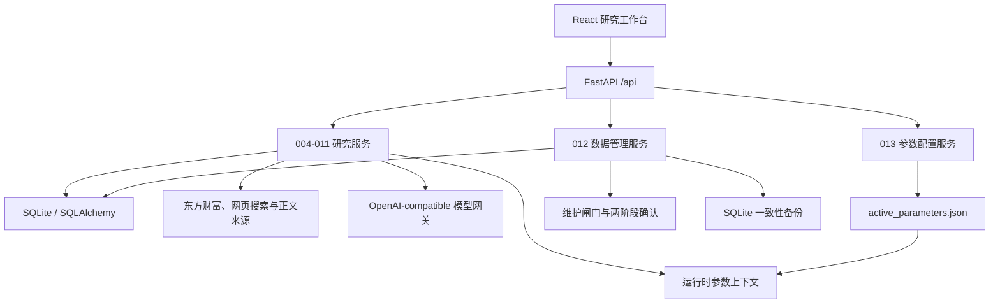

# 001_价值投资分析师系统架构

## 产品定位

系统是一个本地优先、证据驱动、可追溯的价值投资研究工作台。它从公司资料和原始证据出发，经过财务底稿、公告、外部证据、多分析师视角、投资备忘录和无价格锚定估值，最后才结合市场价格生成决策参考。

系统不替代研究者，不管理账户和仓位，也不执行交易。模型输出必须经过结构校验、来源约束和人工复核；评分、估值及价格决策尽量由后端确定性公式完成。

## 当前总体架构

- 前端：React 19、TypeScript、Vite、Lucide。
- API：FastAPI + Pydantic，统一前缀 `/api`。
- 持久化：SQLite + SQLAlchemy，启动时执行建表、轻量迁移和公司种子同步。
- 外部数据：东方财富公司档案、行情、财务、公告，以及网页搜索和正文抓取。
- 智能分析：统一模型网关，结构化结果通过 Pydantic 和业务规则双重校验。
- 参数配置：唯一生效源码为 `backend/app/configuration/active_parameters.json`，缺失或损坏时整包回退内置默认值。
- 运维数据：数据库备份默认位于 `data/backups/`；参数源码文件不属于 SQLite 备份。

## 当前前端信息架构

左侧导航当前全部使用中文，共 12 个入口：

1. 概览
2. 公司搜索
3. 公司工作台
4. 财务底稿
5. 公司公告
6. 外部证据
7. 分析师视角
8. 投资备忘录
9. 估值实验室
10. 价格决策
11. 参数配置
12. 数据管理

其中 004-011 是 `8 / 8` 研究主链路；012 和 013 是独立系统能力，不计入主链路完成度。当前公司选择保存在 React 会话内，搜索词、分页和返回滚动位置可以恢复，但浏览器整页刷新后不会保留当前研究对象。

## 已实现研究主链路

| 模块 | 当前已实现职责 | 主要持久化对象 |
| --- | --- | --- |
| 004 | 公司搜索、新增、档案补全、行情与估值快照刷新 | `Company` |
| 005 | 四类财务报表、按报告期展示、确定性财务证据包 | `FinancialStatement` |
| 006 | 公告同步、正文读取、快速摘要、深度摘要和复核 | `Announcement` |
| 007 | 外部搜索、网页正文提取、手工文本导入、证据筛选与诊断 | `Evidence`、`AnalysisRun` |
| 008 | 8 个固定分析师 Profile、32 条规则、事实账本和价格盲区规则矩阵 | `AnalysisRun` |
| 009 | 委员会叙事综合、来源图和 Memo 版本 | `InvestmentMemo`、`AnalysisRun` |
| 010 | 32 条规则聚合、动态安全边际、参数确认和五模型三情景内在价值 | `ValuationRun` |
| 011 | 读取已确认 010 的冻结安全边际，执行当前价格对照 | `PriceDecisionRun` |

### 主链路数据流

1. 004 建立当前证券身份，维护公司档案、行情、市值和估值倍数快照。
2. 005、006、007 分别形成财务底稿、官方公告和外部证据；007 既支持自动搜索，也支持手工文本导入。
3. 008 从财务、公告和外部证据构建递归净化的价格隔离快照，按固定顺序运行 8 个 Profile、每人 4 条规则；模型输出一旦含价格锚即整次失败。
4. 009 选择至少 2 个 Profile 的最新成功运行，生成确定性委员会账本和纯叙事、可追溯 Memo；不输出评分、权重或安全边际。
5. 010 要求 8 个 Profile 的最新一次运行全部成功且各有精确 4 条规则，聚合 32 条规则并计算动态安全边际；用户确认参数后执行五种确定性估值模型，并冻结公式、权重、贡献和配置快照。
6. 011 绑定已经完成的 010 估值及其固定 Memo，最后才读取当前价格，使用 010 冻结的动态安全边际计算三情景买入价、当前安全边际和价格状态。

## 已实现系统能力

### 012 数据管理

012 是独立 SQLite 运维面，已经实现：

- 只清空某家公司的研究数据并保留公司档案与行情。
- 保留公司及采集资料，只清空全部分析、Memo、估值和价格决策历史。
- 按公司或全局只保留最近 `N` 个版本，并保护 latest、归档及被引用记录。
- 物理清理可安全删除的软删除记录，执行完整性检查、`VACUUM` 和 `ANALYZE`。
- 手动备份、自动备份、保留数量、备份校验、恢复和删除。
- 完整初始化数据库，并在操作前自动创建可恢复备份。
- Preview/Execute 两阶段协议、十分钟一次性令牌、精确确认短语和维护闸门。

### 013 参数配置

013 是 004-011 的统一配置面，当前覆盖七个域：数据采样、财务预警、分析师引擎、估值规则矩阵、Memo 决策、估值模型和价格决策。

- 页面编辑只保存在浏览器内存，未发布修改刷新后丢失。
- 校验不写文件；发布经完整校验和警告确认后原子覆盖唯一参数 JSON。
- 当前没有草稿、配置版本、发布历史或回滚流程。
- 新生成的 008-011 运行保存 `config_hash` 和完整 `config_snapshot`；后续发布不会追溯改变历史结果。
- `ParameterConfigVersion` 仅作为旧数据库兼容表保留，当前配置流程不再读写。
- price-blind、会计基础定义、规则角色和历史不可变性等结构性约束固定在代码中，不能通过配置关闭。

## 当前核心数据模型

| 实体 | 主要用途 | 生命周期要点 |
| --- | --- | --- |
| `Company` | 当前证券身份、档案和行情快照 | 当前仍同时承担公司主体与上市证券身份 |
| `FinancialStatement` | 四类原始财务底稿 | 按公司、期间和报表类型保存 |
| `Announcement` | 公告元数据、正文和当前摘要 | 摘要不保留版本历史 |
| `Evidence` | 外部证据、评分、复核和原始快照 | 自动搜索和手工导入共用 |
| `AnalysisRun` | 搜索、导入、分析师和 Memo 生成运行 | 保存输入、结果及参数快照 |
| `InvestmentMemo` | 投资备忘录版本 | 支持 latest、归档、软删除和来源链 |
| `ValuationRun` | 无锚定估值草稿与计算结果 | 重算创建新记录，不原地覆盖 |
| `PriceDecisionRun` | 估值与价格对照版本 | 绑定固定估值和 Memo，支持软删除 |

系统当前以 `ticker + exchange` 唯一识别 `Company`。同名多地上市证券按 A 股、港股、美股排序，种子同步可能把同名低优先级市场记录原地升级为更高优先级证券。这种策略适合当前“每家公司只保留一个主要研究标的”的实现，但不适合未来真正的多地上市研究。

## 当前市场支持边界

当前已经存在 A 股、港股和美股公司种子，但“公司能被搜索或显示行情”不等于“完整研究链路已经适配”。

| 能力 | A 股 | 港股 | 美股 | 当前说明 |
| --- | --- | --- | --- | --- |
| 公司种子、搜索和手工新增 | 已支持 | 已支持 | 已支持 | 标准种子共 61 家：A 股 47、港股 4、美股 10 |
| 行情、估值倍数快照 | 已支持 | 基础支持 | 基础支持 | 行情适配器识别 `.SH/.SZ/.HK/.US` |
| 公司简介、上市日期自动补全 | 已支持 | 未支持 | 未支持 | 当前公司档案适配器只支持 A 股 |
| 分红明细与股息率补全 | 已支持 | 未完整支持 | 未完整支持 | 分红明细代码转换只覆盖 A 股 |
| 四类财务报表同步 | 已形成 A 股口径 | 未形成完整合同 | 未形成完整合同 | 当前围绕东方财富 F10 字段和 CNY 口径建立，缺少港美股完整回归保证 |
| 公告自动同步与正文 | 已支持 | 未支持 | 未支持 | 当前公告适配器只接受 6 位 A 股代码 |
| 外部搜索和手工证据 | 已支持 | 可复用 | 可复用 | 逻辑基本市场无关，但搜索词、来源分级仍需本地化 |
| 008-011 分析、估值和决策 | 已支持 | 条件性可运行 | 条件性可运行 | 依赖上游数据完整度；估值结果和单位当前仍存在 CNY 假设 |

## 不可破坏的架构边界

- **价格隔离**：004 可以保存行情，但 008、009、010 的模型输入和计算必须清除当前价、市值、目标价、估值倍数和交易动作；价格只在 011 进入。
- **确定性计算**：财务指标、规则评分、估值、敏感性和价格区间由后端公式计算；模型只负责受约束的结构化研究判断和参数建议。
- **历史可复现**：009-011 不回溯替换已绑定来源；008-011 保存输入或参数快照，重算创建新版本。
- **缺失不猜测**：数据缺口必须进入结果、置信度或诊断，不能用 0 静默补齐。
- **来源可追溯**：公告保留原始链接，Evidence 保留原始快照，分析运行保留来源引用和输入哈希。
- **配置整包一致**：同一请求不能混用新旧参数；配置损坏时整包回退内置默认值。
- **运维隔离**：破坏性操作使用预览令牌、确认短语、一致性备份和维护闸门。

## 当前范围之外

- 仓位、持仓、组合、账户和收益归因。
- 自动交易、券商接入和订单执行。
- 多用户权限、云端协作和生产级分布式任务队列。
- 港美股全链路数据合同、跨币种估值、ADR/存托凭证换算和同一主体多地上市对照。
- 面向用户的通用“其他功能”工具箱。

## 下一阶段规划建议（未实现）

### 014 多市场证券与数据源适配

港美股适配不应从“再接两个行情接口”开始，建议先补齐共同的市场基础层：

1. **拆分公司主体与上市证券**：新增类似 `Issuer` 与 `Listing/Security` 的两层身份。研究事实归属于主体，行情、交易所、币种、股本、ADR 比例归属于证券；同一家公司可以保留 A/H/美股多个上市标的，不再原地覆盖。
2. **建立能力矩阵**：每个市场适配器声明 `profile`、`quote`、`financials`、`filings`、`dividend`、`fx` 等能力。前端根据真实能力启用操作并显示缺失原因。
3. **统一财务语义层**：原始字段按数据源保留，再映射到内部标准字段；明确 PRC GAAP、HKFRS/IFRS、US GAAP 的字段差异、财政年度、累计期、单季、TTM、币种和金额缩放。
4. **补齐币种合同**：财务、估值总值、每股价值和市场价格都携带 ISO 币种；010 保持 price-blind，011 才使用带时间戳的汇率和 ADR/每份对应股数，把内在价值转换到目标上市证券币种。
5. **按市场接入官方披露**：港股优先接 HKEX 披露；美股优先接 SEC EDGAR/XBRL，再单独选择可靠行情来源。公告或 filing 需要统一为可供 008 使用的披露证据接口，而不是强行套用 A 股公告字段。
6. **分市场交付**：先完成基础模型和能力矩阵，再打通一只港股的 004-011 全链路，然后打通一只美股，最后做同一主体多地上市、跨币种和缺失能力回归。

建议把“港股适配完成”或“美股适配完成”定义为：档案、财务、披露、证据、估值币种和价格决策均能闭环，而不是仅能搜索公司和刷新行情。

### 015 其他功能工具箱

前端增加统一“其他功能”入口是可行的，但应把它定义为低耦合工具箱，而不是未分类功能的长期堆放区。

适合放入的功能应同时满足大部分条件：不属于 004-011 主链路、不拥有复杂业务状态、失败不阻断研究流程、可以独立使用。第一批可考虑：

- 复利、折现、安全边际和 CAGR 快速计算器。
- 金额单位、百分比、每股值和币种换算工具；涉及实时汇率时必须显示来源和时间。
- 证券代码、交易所和报告期格式检查工具。
- 文本或 CSV 导入前的字段识别、编码检查和预览工具。
- 本地环境、数据源和模型连通性的只读诊断汇总。

不建议放入“其他功能”的内容包括：多市场适配、公司对比、关注列表、组合管理、导入导出中心、定时同步和系统级配置。这些功能一旦拥有持久化数据、独立权限、后台任务或主链路依赖，应升级为单独模块。

实现上建议使用工具注册表，而不是在一个巨型页面中持续追加条件分支。每个工具定义稳定 `id`、中文名称、分类、图标、懒加载组件和所需能力；工具默认无后端持久化，确需保存领域数据时再建立独立 API 和数据模型。

可采用以下升级规则：一个工具只要满足“拥有独立持久化实体、被主链路引用、包含多个页面、需要后台任务、需要单独权限”中的任一项，就从“其他功能”提升为正式模块。

## 建议开发顺序

1. 先建立 014 的主体/证券模型、币种合同和数据源能力接口，不改分析公式。
2. 用一只港股完成最小全链路垂直验证，再补港股覆盖面。
3. 接入 SEC/XBRL，用一只美股完成同样的全链路验证。
4. 增加同一主体多地上市、汇率和 ADR 比例测试。
5. 再创建 015“其他功能”入口和工具注册机制，首批只放 2-3 个真正独立的小工具。
6. 每完成一个市场或工具，更新对应 memory 文档、API 合同、数据清理语义和参数配置边界。

开发模块的具体合同以 `memory/002` 至 `memory/013` 和 `docs/api.md` 为准；本文件只维护系统级现状、边界和下一阶段架构方向。
