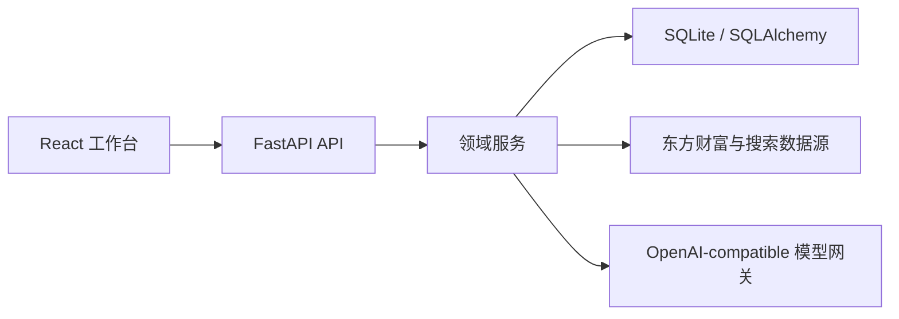
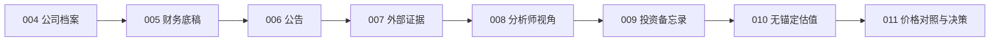

# 001_价值投资分析师系统架构

## 产品定位

系统是一个本地优先、证据驱动、可追溯的价值投资研究工作台。它帮助研究者从公司资料和原始证据出发，形成多视角判断、无价格锚定估值，并在最后一步结合市场价格生成决策参考。

系统不替代研究者，也不执行交易。模型输出必须经过结构校验、来源约束和人工复核。

## 当前技术架构

- 前端：React 19、TypeScript、Vite、Lucide。
- API：FastAPI + Pydantic，统一前缀 `/api`。
- 持久化：SQLite + SQLAlchemy，使用启动期轻量迁移。
- 外部数据：公司档案、行情、财务、公告和网页搜索。
- 智能分析：统一模型网关，所有结构化结果先通过 Pydantic 校验。

## 已实现研究主链路

| 模块 | 当前职责 | 主要持久化对象 |
| --- | --- | --- |
| 004 | 公司搜索、新增、档案与行情刷新 | `Company` |
| 005 | 四类财务报表、60 期展示、财务证据包 | `FinancialStatement` |
| 006 | 一年公告同步、正文读取、快速/深度摘要 | `Announcement` |
| 007 | 外部搜索、筛选、模型提取、复核与诊断 | `Evidence`、`AnalysisRun` |
| 008 | 10 个 Profile、40 条规则、估值参数矩阵 | `AnalysisRun` |
| 009 | 委员会汇总、评分、安全边际建议、Memo 版本 | `InvestmentMemo`、`AnalysisRun` |
| 010 | 五模型 price-blind 估值、敏感性与置信度 | `ValuationRun` |
| 011 | 当前价格对照、买入价和价格状态 | `PriceDecisionRun` |

## 核心数据流

1. 公司档案提供证券身份、行业、行情和市值等基础信息。
2. 财务、公告和外部证据形成可引用的研究输入。
3. 分析师引擎按 10 个 Profile 和 40 条规则生成独立结论与估值参数矩阵。
4. Memo 聚合最新成功分析，形成委员会账本、评分和建议安全边际。
5. 估值实验室读取财务证据包与最新 008 矩阵，用户确认参数后执行五模型计算。
6. 价格决策绑定已完成估值及其 Memo，最后才读取当前价格并生成决策区间。

## 关键边界

- **价格隔离**：004 可保存行情，但 008、009、010 的模型输入和计算必须清除价格锚点。
- **确定性计算**：财务指标、评分、估值和价格区间由后端公式计算；模型只提供结构化研究判断和参数建议。
- **不可变来源**：011 不回溯替换估值绑定的 Memo；每次决策保存完整快照和公式版本。
- **人工控制**：规则状态、估值假设、安全边际覆盖和历史删除均要求显式操作。
- **失败可见**：数据缺口、模型失败、搜索过滤原因和来源覆盖必须进入结果或诊断信息。

## 当前范围之外

- 仓位、持仓、组合和账户管理。
- 自动交易、券商接入和收益归因。
- 多用户权限、云端协作和生产级任务队列。

## 后续增强方向

1. 数据源自动化：定时增量同步、失败重试、来源健康度和数据新鲜度告警。
2. 财务口径增强：严格 ROIC、投入资本、维持性资本开支、回购和分红连续性。
3. 证据质量增强：更稳定的正文抓取、来源分级、重复检测与引用定位。
4. 研究可观测性：统一运行诊断、耗时、模型成本和数据缺口看板。
5. 版本比较：在现有历史记录上增加估值、Memo 与价格决策的差异视图。

开发模块的当前细节以 `memory/002` 至 `memory/011` 和 `docs/api.md` 为准。
