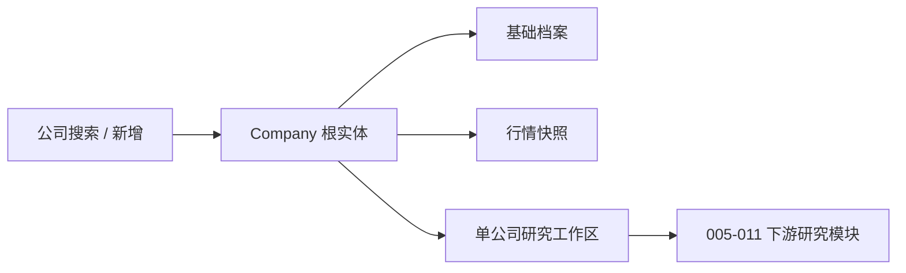

# 004_公司搜索与公司档案页

## 模块定位

004 是研究主链路的入口和根上下文，负责维护“研究的是哪家公司、对应哪一只上市证券、当前基础档案和市场快照是什么”。后续财务、公告、外部证据、分析师视角、Memo、估值和价格决策均通过 `company_id` 关联到 `Company`。

本模块只维护公司主数据和研究用行情快照，不负责持仓、交易或价格驱动的投资结论。004 保存的价格与估值倍数可以供 011 做最终价格对照，但不得进入 008-010 的 price-blind 分析和估值输入。

## 当前实现概览

- 本地公司池支持关键词搜索、总数统计和 offset 分页。
- 公司以 `ticker + exchange` 唯一识别，API 创建时统一转为大写。
- 标准种子共 61 家：A 股 47 家、港股 4 家、美股 10 家。
- 当前本地数据库审计为 62 家；多出的记录属于已有非标准种子，初始化不会删除。
- 同名多地上市证券按 A 股 > 港股 > 美股排序。
- 公司详情可按需补齐上市日期和种子占位简介；用户维护的真实简介不会被自动覆盖。
- 主动刷新会更新价格、市值、估值倍数、股息率、来源和更新时间。
- 前端保存当前研究公司，并在从档案返回时恢复搜索词、分页和滚动位置。

## Company 数据模型

`Company` 位于 `backend/app/db/models.py`，是所有公司研究数据的根实体。

| 类别 | 字段 | 说明 |
| --- | --- | --- |
| 主键 | `id` | 下游研究对象统一使用的 `company_id` |
| 证券身份 | `ticker`、`exchange`、`name` | `ticker + exchange` 有唯一约束；名称有索引 |
| 基础档案 | `industry`、`description`、`listed_date` | 行业、公司简介和上市日期均可为空 |
| 研究管理 | `status`、`tags` | 状态是自由文本；标签使用 JSON 数组 |
| 市场快照 | `market_cap`、`current_price` | 市值和当前价格，均允许为空 |
| 估值倍数 | `pe_ttm`、`pe_dynamic`、`pe_static`、`pb_ratio`、`ps_ratio` | TTM/动态/静态市盈率、市净率和市销率 |
| 股息率 | `dividend_yield_ttm`、`dividend_yield_static` | 小数存储，例如 `0.04` 表示 4% |
| 行情审计 | `market_data_source`、`market_data_source_url`、`market_data_updated_at` | 保存实际来源、请求地址和抓取时间 |
| 时间 | `created_at`、`updated_at` | API 输出统一序列化到 `Asia/Shanghai` |

当前模型没有 `total_shares` 或独立的 `profile_source` 字段。股本只在股息率计算中通过 `market_cap / current_price` 临时推导，不持久化。

`Company` 与以下实体建立一对多关系，并启用 ORM 级联删除：

- `FinancialStatement`
- `Announcement`
- `Evidence`
- `AnalysisRun`
- `InvestmentMemo`
- `ValuationRun`
- `PriceDecisionRun`

## 公司池与证券身份策略

### 标准种子

`init_db()` 在建表和轻量迁移后调用 `seed_db()`，幂等写入 `REAL_COMPANY_SEEDS`。标准种子只提供真实公司主数据，不包含实时行情或投资建议。

种子更新规则：

1. 先按精确的 `ticker + exchange` 查找。
2. 精确记录不存在时，按完全相同的公司名称寻找更低优先级市场记录。
3. 市场优先级固定为 SSE/SZSE/BSE > HKEX > NASDAQ/NYSE/AMEX。
4. 若需要升级上市地，则原地修改证券身份，保留 `company_id` 和下游研究关系。
5. 跨市场升级时清空上市日期、价格、市值、估值倍数、股息率及行情来源，避免旧市场快照混入新证券身份。
6. 初始化会更新种子名称、行业和标签，但保留已有 `status`，也不会删除手工新增公司。

中国移动是该策略的实际迁移案例：原 `00941.HK / HKEX` 记录原地升级为 `600941.SH / SSE`，主键不变。

该策略目前依赖公司名称完全一致。历史名称、中文/英文别名和不同上市地名称不一致时，不会自动判断为同一发行人。

### 搜索与排序

搜索词会去除首尾空白，并使用不区分大小写的包含匹配，覆盖以下字段：

- `ticker`
- `name`
- `exchange`
- `industry`
- `description`
- JSON `tags` 的文本表示

查询分别执行列表读取和总数统计。排序顺序为：

1. 公司名称。
2. 同名公司按 A 股、港股、美股、其他市场排序。
3. 同市场再按证券代码排序。

这里的优先级只影响展示和默认取第一条的行为，不会自动合并数据库中已经同时存在的多地上市记录。

## API 合约

### `GET /api/companies`

用途：搜索和分页读取公司池。

| 参数 | 默认值 | 约束 | 说明 |
| --- | --- | --- | --- |
| `q` | 空 | 可选字符串 | 按代码、名称、交易所、行业、简介和标签搜索 |
| `limit` | 运行时参数 | `>= 1` 且不得超过运行时上限 | 未传时读取 `data_sampling.company_list_limit` |
| `offset` | `0` | `>= 0` | offset 分页起点 |

响应为 `CompanyListResponse`：`items`、`total`、`limit`、`offset`。如果 `limit` 超过 `data_sampling.company_list_limit_max`，返回 `422` 和当前上限说明。

### `POST /api/companies`

用途：手工新增研究公司。

必填字段：`ticker`、`exchange`、`name`。可选字段：`industry`、`description`、`listed_date`、`status`、`tags`。

输入规范化：

- 必填文本去除首尾空白，空字符串校验失败。
- `ticker` 和 `exchange` 保存前转为大写。
- 可选文本的空字符串转为 `null`。
- 标签去空白、去空项并按首次出现顺序去重。
- `status` 的 API 默认值为“未研究”。
- 重复的 `ticker + exchange` 返回 `409`。

### `GET /api/companies/{company_id}`

用途：读取公司详情，是工作区加载的必需请求。

读取流程：

1. 公司不存在时返回 `404 Company not found`。
2. 如果 `listed_date` 为空，或简介为空/仍是种子占位文案，则尝试调用东方财富公司概况。
3. 公司概况调用失败时吞掉数据源异常，仍返回本地已有详情，避免档案页因为补充信息失败而不可用。
4. 自动补全只填充缺失上市日期，并且只替换空简介或带种子标记的简介，不覆盖真实简介。

该接口不会自动刷新价格和估值倍数。

### `POST /api/companies/{company_id}/profile/refresh`

用途：用户主动更新基础档案和市场快照。

处理顺序：

1. 按与详情接口相同的规则，尽力补充上市日期和简介。
2. 无论基础档案是否变化，都继续刷新行情快照。
3. 行情成功后覆盖全部市场快照字段并提交。

错误映射：

| 情况 | HTTP 状态 | 行为 |
| --- | --- | --- |
| 公司不存在 | `404` | 返回 `Company not found` |
| 当前证券代码不受行情适配器支持 | `400` | 返回明确的不支持代码说明 |
| 东方财富行情请求或结构异常 | `502` | 返回上游数据源错误 |
| 公司概况补全失败但行情可用 | `200` | 忽略概况错误，继续返回更新后的行情 |

## 外部数据适配器

### 公司概况

`EastmoneyCompanyProfileClient` 调用东方财富 `CompanySurvey/PageAjax`，超时为 12 秒。

- 当前只转换 `.SH` 和 `.SZ` 证券代码。
- `.SH` 转为 `SHxxxxxx`，`.SZ` 转为 `SZxxxxxx`。
- 从 `fxxg[0].LISTING_DATE` 读取上市日期。
- 公司简介优先读取 `jbzl[0].ORG_PROFILE`，其次读取 `BUSINESS_SCOPE`。
- HTTP、非 JSON、结构异常和非法代码都转换为明确的数据源异常。

### 行情快照

`EastmoneyMarketSnapshotClient` 支持 `.SH`、`.SZ`、`.HK`、`.US`，依次尝试实时和延迟两个行情接口：

1. `push2.eastmoney.com/api/qt/stock/get`
2. `push2delay.eastmoney.com/api/qt/stock/get`

第一个接口发生 HTTP、JSON 或业务结构错误时会继续尝试延迟接口；全部失败后才向上抛出错误。

东方财富字段映射：

| 东方财富字段 | Company 字段 |
| --- | --- |
| `f43` | `current_price` |
| `f116` | `market_cap` |
| `f164` | `pe_ttm` |
| `f162` | `pe_dynamic` |
| `f163` | `pe_static` |
| `f167` | `pb_ratio` |
| `f173` | `ps_ratio` |

`""`、`-`、`--` 和无法转成数值的内容统一保存为 `null`。行情抓取时间统一转换为上海时区。

### 股息率口径

A 股会额外尝试读取东方财富 `BonusFinancing/PageAjax`。分红接口失败不会阻断其他行情字段更新，只会使股息率缺失。

当前口径：

- 严格 TTM：汇总截至抓取日向前 365 天内、状态包含“实施”的每 10 股现金分红，再除以 10 和当前股价。
- 最新披露口径：若存在尚未实施的最新现金分红方案，使用该方案对应现金分红加同一财年的已汇总分红，再除以市值。
- 静态口径：优先采用最新披露口径；否则使用最近年度 `TOTAL_DIVIDEND / market_cap`。
- 半截年度保护：仅当存在待实施方案，且最新年度总分红低于上一年度 50% 时，静态口径允许回退上一完整年度。
- TTM 归一化：如果严格 TTM 缺失，或低于静态口径的一半，则 `dividend_yield_ttm` 使用静态口径，避免因实施日期漂移明显低估。

该算法覆盖年内多次分红、实施日期跨出 365 天窗口和已披露但未实施方案。泸州老窖一类场景因此会按最新披露的完整年度现金分红计算，而不是只保留窗口内的一次小额分红。

分红明细代码转换当前只支持 `.SH` 和 `.SZ`，所以港股和美股通常只能获得报价与估值倍数，股息率可能为空。

## 前端状态与交互

### 应用级公司状态

`App` 持有以下状态：

- `selectedCompany`：当前研究对象的完整 `Company` 快照。
- `activeCompanySection`：工作区当前 section。
- `companySearchLocation`：搜索词和 offset。
- `companySearchScrollTop`：从搜索结果进入档案前的窗口滚动高度。
- `companySearchRestoreToken`：控制返回搜索后的单次滚动恢复。
- `refreshToken`：顶部全局刷新按钮触发各当前视图重新读取。

当前选择只保存在 React 会话内，浏览器整页刷新后不会恢复。

### 公司搜索页

`CompanySearchView` 的关键行为：

- 搜索词或 offset 变化时立即重新请求，没有额外 debounce。
- 每次请求使用 `AbortController`；组件卸载或条件变化时取消旧请求。
- 前端不固定传 `limit`，由后端运行时参数决定实际页大小。
- 上一页和下一页使用响应中的 `limit` 计算 offset，因此参数中心修改页大小后仍能正确分页。
- 搜索词变化时 offset 重置为 0。
- 加载、错误、空结果和正常列表使用独立界面状态。
- 只有“当前未选择公司且搜索词为空”时展示新增公司表单；搜索中不会继续显示新增面板。
- 标签输入支持中英文逗号、分号和顿号分隔，并在提交前去重。
- 新增成功后清空表单、刷新公司池并直接进入新公司档案。

返回恢复流程：

1. 点击公司行“档案”时记录 `window.scrollY`。
2. 搜索词和 offset 已由 `App` 持有，不随搜索组件卸载而丢失。
3. 返回搜索后重新请求原分页数据。
4. 等当前页数据进入 ready 状态后，通过下一帧恢复原滚动高度。
5. restore token 保证同一次返回只恢复一次；在当前搜索页重复点击导航不会跳到旧位置。

### Dashboard

Dashboard 使用 `GET /companies?limit=6&offset=0` 读取公司池：

- 公司总数显示在“研究公司”指标。
- 前 6 条按公司列表标准排序显示为“最近公司”；它不是按最近访问或更新时间排序。
- 点击公司行直接设置当前公司并进入 Overview。
- 未选择公司时，研究主链路按钮不可用，并提供“选择研究公司”入口。

### 单公司工作区

`CompanyWorkspaceView` 包含 8 个 section：Overview、Financials、Announcements、Evidence、Analyst Views、Memo、Valuation Lab、Price Decision。

进入工作区时，`getCompany(companyId)` 是唯一必需请求。财务、财务证据包、公告、证据、模型配置、分析师配置、分析运行、Memo、估值和价格决策请求均通过 `withOptionalWorkspaceData()` 提供空值回退。因此单个可选模块的 `404` 或其他读取失败不会让基础档案整体显示“加载失败”。

失败边界：

- 必需公司请求返回 `Company not found`：清除当前选择并返回公司搜索页。
- 必需公司请求发生其他错误：显示“公司档案加载失败”。
- 可选模块请求失败：对应模块使用空列表或空对象，基础档案仍可见。
- 切换公司、全局刷新或组件卸载时，取消尚未完成的读取请求。

基础档案显示：

- 公司名称、市场、代码、行业和标签。
- 公司简介、上市日期、档案更新时间和行情更新时间。
- 市值、价格、三种市盈率、市净率、市销率和 TTM 股息率。

`dividend_yield_static` 已持久化并通过 API 返回，但当前基础档案界面只展示 `dividend_yield_ttm`。

点击“更新”调用主动刷新接口。成功后只替换工作区内的 `company` 数据并显示“基本信息已更新”；失败时保留旧档案并在面板内显示错误，不会退出工作区。

## 参数与配置边界

004 直接使用的运行时参数只有公司列表采样参数：

| 参数路径 | 默认值 | 校验范围 | 当前作用 |
| --- | --- | --- | --- |
| `data_sampling.company_list_limit` | 20 家 | 1-100 | 未显式传 `limit` 时的默认页大小 |
| `data_sampling.company_list_limit_max` | 100 家 | 20-500 | 公司列表单次请求硬上限 |

参数来自 `backend/app/configuration/active_parameters.json`；文件缺失时使用集中默认值，文件损坏时整包回退。参数只改变采样规模，不改变公司池总数，也不进入分析或估值公式。

同名上市地优先级属于证券身份结构性约束，不作为普通参数开放。

## 当前测试覆盖

后端核心回归覆盖：

- 标准种子数量、代表性 A/H/美股和中国移动 A 股身份。
- 名称/代码搜索和同名公司 A 股 > 港股 > 美股排序。
- 公司详情、缺失上市日期和种子简介自动补全。
- 主动行情刷新、上海时区序列化和不支持证券代码错误。
- 实时行情失败后切换延迟接口。
- 严格 TTM、最新待实施方案、半截年度保护和无待实施方案保护。
- 新增公司、输入规范化和重复证券身份冲突。
- 已有数据库幂等补种和跨市场升级保持原 `company_id`。

前端核心回归覆盖：

- Dashboard、公司搜索和工作区主路径。
- 搜索时隐藏新增公司面板。
- 第二页带关键词进入档案后恢复关键词、分页和滚动位置。
- 可选工作区接口失败时基础档案仍可见。
- 主动刷新后更新行情展示。
- 公司不存在时清除选择并返回搜索页。

## 已知限制

- 公司详情适配器只支持 A 股，港股和美股不能自动补齐简介与上市日期。
- 行情快照是研究用抓取结果，不是交易级实时行情，不提供盘口、复权或历史序列。
- 分红明细当前只覆盖 A 股；港股和美股股息率可能为空。
- 跨市场识别依赖完全相同的公司名称，没有独立发行人实体、别名表或证券主从关系。
- 搜索使用数据库包含匹配和 JSON 文本匹配，未接入拼音、分词、模糊纠错或相关性评分。
- Dashboard 的“最近公司”实际是公司列表前 6 条，不是访问历史。
- 当前公司选择、搜索上下文和滚动位置只在当前前端会话保存，整页刷新后丢失。
- 没有公司编辑、删除、合并或手工选择主上市地的前端流程。
- 公司状态是自由文本，尚未使用受控枚举或状态流转规则。

## 关键文件

| 文件 | 职责 |
| --- | --- |
| `backend/app/db/models.py` | `Company` 模型、唯一约束和下游关系 |
| `backend/app/db/init_db.py` | 61 家标准种子、幂等写入和跨市场身份升级 |
| `backend/app/schemas/company.py` | 创建与读取 Pydantic 合约、输入规范化和时区序列化 |
| `backend/app/api/routes/companies.py` | 公司列表、创建、详情和刷新 API |
| `backend/app/services/companies.py` | 搜索、排序、创建和档案/行情持久化 |
| `backend/app/data_sources/eastmoney_company_profile.py` | A 股上市日期和公司简介适配器 |
| `backend/app/data_sources/eastmoney_market_snapshot.py` | A/H/美股行情、估值倍数、股息率和延迟接口回退 |
| `backend/app/configuration/active_parameters.json` | 公司列表默认页大小与单次请求上限 |
| `frontend/src/services/api.ts` | Company 类型与 API 客户端 |
| `frontend/src/app/App.tsx` | 当前公司、搜索上下文和视图导航状态 |
| `frontend/src/app/CompanySearchView.tsx` | 搜索、分页、新增和返回位置恢复 |
| `frontend/src/app/CompanyWorkspaceView.tsx` | 必需公司详情、可选模块降级和档案展示 |
| `frontend/src/app/DashboardView.tsx` | 公司池总数、当前公司和前 6 条公司入口 |
| `backend/app/tests/test_companies.py` | 公司、种子、数据源和行情口径回归测试 |
| `frontend/src/tests/App.test.tsx` | 公司搜索、档案和状态恢复交互测试 |

### 2026-08-17 参数语义复核

- `company_list_limit` 现在是后端在请求未提供 `limit` 时使用的真实默认条数，前端不再固定传 20；翻页继续沿用响应中的实际 `limit`。
- `company_list_limit_max` 现在由后端统一限制每次请求允许的最大条数，不再只是配置页可编辑但业务路径未读取的字段。
