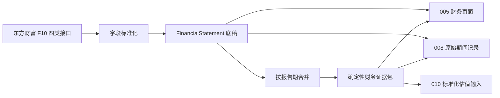

# 005_公司详情财务

## 模块定位

005 负责把外部财务数据转换为两层本地研究资产：

1. 可追溯的原始财务底稿 `FinancialStatement`。
2. 后端确定性计算的 `financial_evidence_pack` 财务证据包。

005 不直接生成投资结论。008 分析师视角读取财务底稿和证据包形成财务判断，010 无锚定估值实验室再从证据包提取标准化估值输入。



## 当前数据范围与数量语义

当前东方财富适配器对每家公司同步四类记录：

| `statement_type` | 中文名称 | `source` | 主要用途 |
| --- | --- | --- | --- |
| `main_financial_indicators` | 主要财务指标 | `eastmoney_f10_main_finance` | 核心规模、盈利率、同比、效率和每股指标 |
| `income_statement` | 利润表 | `eastmoney_f10_income_statement` | 收入成本、费用、利润构成、减值、税率和非经常性项目 |
| `cash_flow_statement` | 现金流量表 | `eastmoney_f10_cash_flow` | 经营现金流、资本开支、自由现金流、分红和投融资现金流 |
| `balance_sheet` | 资产负债表 | `eastmoney_f10_balance_sheet` | 货币资金、有息负债、净现金、资产负债、权益、总股本和回购代理字段 |

必须区分“报告期”和“财务记录”：同一个报告期最多有四张表，因此 60 个报告期最多约为 240 条 `FinancialStatement`。

| 消费位置 | 当前参数 | 数量单位 | 当前行为 |
| --- | ---: | --- | --- |
| 005 前端与公开证据包 API | `financial_display_periods = 60` | 报告期 | 取最近 60 个不同报告期，并保留每期全部已入库分表 |
| 008 分析师快照 | `analysis_financial_periods = 40` | 报告期 | 取最近 40 个不同报告期；四表齐全时可包含 160 条记录 |
| 010 估值快照 | `valuation_financial_records = 120` | 财务记录 | 按记录倒序取 120 条，再构建估值使用的证据包；不是 120 个报告期 |
| 同步接口 | `limit = 60` | 每类报表的返回行数 | 四个数据源分别最多取 60 行，总抓取量最多约 240 条 |

## 外部采集与字段标准化

### 主要财务指标

主要标准字段：

- 期间：`report_date`、`report_type`、`notice_date`
- 规模：`revenue`、`gross_profit`、`net_profit`、`deducted_net_profit`
- 每股：`eps`、`bps`、`operating_cash_flow_per_share`
- 盈利：`roe`、`gross_margin`、`net_margin`
- 成长：`revenue_yoy`、`net_profit_yoy`
- 安全与效率：`asset_liability_ratio`、`total_assets_turnover`、`inventory_turnover_days`
- 现金含量：`operating_cash_flow_to_revenue`
- 来源校验：`raw_secucode`、`raw_security_name`

东方财富的百分数字段通过 `_percent_to_ratio()` 除以 100，统一存为 `0-1` 小数。`operating_cash_flow_to_revenue` 使用兼容转换：绝对值不超过 1 时视为已是小数，否则除以 100，避免 `48.62` 和 `0.4862` 两种上游口径造成重复换算。

### 利润表

主要标准字段：

- 收入成本：`revenue`、`operating_cost`、`gross_profit`、`taxes_and_surcharges`
- 期间费用：`selling_expense`、`admin_expense`、`r_and_d_expense`、`finance_expense`
- 利润构成：`other_income`、`investment_income`、`fair_value_change_income`
- 资产质量：`credit_impairment_loss`、`asset_impairment_loss`
- 主营与税前利润：`operating_profit`、`total_profit`
- 营业外项目：`non_operating_income`、`non_operating_expense`
- 税与净利润：`income_tax_expense`、`net_profit`、`parent_net_profit`、`minority_interest`、`deducted_net_profit`
- 每股与来源：`eps`、`raw_secucode`、`raw_security_name`

`gross_profit` 在采集层按 `revenue - operating_cost` 计算。研发费用兼容 `RESEARCH_EXPENSE` 和 `ME_RESEARCH_EXPENSE` 两个上游字段。

### 现金流量表

主要标准字段：

- `operating_cash_flow`
- `purchase_fixed_assets_cash_paid`
- `capital_expenditure`
- `free_cash_flow`
- `depreciation_and_amortization`
- `working_capital_change`
- `dividend`
- `net_cash_from_investing`
- `net_cash_from_financing`

当前资本开支使用“购建固定资产、无形资产和其他长期资产支付的现金”的绝对值：

```text
capital_expenditure = abs(purchase_fixed_assets_cash_paid)
free_cash_flow = operating_cash_flow - capital_expenditure
```

折旧摊销由长期待摊费用摊销、无形资产摊销、使用权资产摊销和递延收益摊销的已知值相加。营运资本变动由经营性应收减少、存货减少和经营性应付增加的已知值相加。

### 资产负债表

主要标准字段：

- 现金与负债：`cash_and_equivalents`、`short_term_interest_bearing_debt`、`long_term_interest_bearing_debt`、`interest_bearing_debt`、`net_cash`
- 资产负债：`total_assets`、`total_liabilities`、`shareholders_equity`、`total_equity`
- 资产质量：`goodwill`、`receivables`、`inventory`
- 股本回报：`shares_outstanding`、`treasury_shares`、`buyback_amount_proxy`、`dividend_payable`

当前有息负债定义：

```text
short_term_interest_bearing_debt =
  short_loan + short_bond_payable + short_financial_payable
  + noncurrent_liability_due_within_one_year

long_term_interest_bearing_debt =
  long_loan + bond_payable + lease_liability

interest_bearing_debt = short_term_interest_bearing_debt
                      + long_term_interest_bearing_debt

net_cash = cash_and_equivalents - interest_bearing_debt
```

`buyback_amount_proxy` 当前直接使用资产负债表的库存股字段，只能证明存在库存股或提供代理金额，不能等同于本期真实回购现金流。证据包仍会把缺少 `buyback_amount` 记为数据缺口。

## 数据库存储合同

`FinancialStatement` 当前真实字段如下：

| 字段 | 含义 |
| --- | --- |
| `id` | 数据库记录 ID；前端显示为 `#xxx` |
| `company_id` | 所属公司 |
| `period` | 中文或兼容格式的报告期，如 `2025年报`、`2025三季报`、`2025Q4` |
| `statement_type` | 报表类型 |
| `currency` | 币种，东方财富缺失时默认 `CNY` |
| `fields` | 标准化字段 JSON；`report_date`、`report_type`、`notice_date` 均在这里 |
| `source` | 数据源名称 |
| `source_url` | 本次请求的完整来源 URL |
| `created_at` | 首次创建时间；API 按 Asia/Shanghai 序列化 |

当前模型没有 `source_record_id`、`raw_snapshot` 或 `updated_at` 字段。数据库唯一约束为：

```text
(company_id, period, statement_type)
```

同步时，同公司、同报告期、同报表类型存在记录则覆盖 `currency`、`fields`、`source` 和 `source_url`，否则新建。更新不会改变 `id` 和 `created_at`。

## 排序、分页与同步

统一排序键为：

```text
fields.report_date DESC, period DESC, id DESC
```

财务列表有两套兼容语义：

- 传 `period_limit` 时按不同报告期分页，并返回所选报告期内的全部分表。
- 只传旧参数 `limit` 时按单条财务记录分页。
- 不传 `limit` 时默认进入报告期分页，使用 `financial_display_periods`。

`list_company_financials_by_periods()` 的响应中：

- `items` 是所选报告期的全部记录。
- `total` 是公司的财务记录总数，不是报告期总数。
- `limit` 在 API 响应里写入本次返回的记录条数。
- `offset` 在报告期模式下表示 `period_offset`。

同步依次抓取主要指标、利润表、现金流量表和资产负债表。`fetched/created/updated` 都按财务记录计数，不按报告期计数。同步响应顶层 `source` 目前固定为 `eastmoney_f10_main_finance`，真实分表来源应以每条 `items[].source` 为准。

## 财务证据包构建

### 合并规则

`build_financial_evidence_pack()` 先把每条底稿投影为：

```json
{
  "id": 123,
  "period": "2025年报",
  "statement_type": "income_statement",
  "fields": {}
}
```

随后按 `period` 合并同期分表，只把非空值写入合并后的 `fields`，再计算派生字段。合并后的内部快照记录 `statement_types` 和 `source_statement_ids`，但当前公开证据包没有输出事实级 `source_statement_ids`；事实追溯需要同时保留原始 `financial_statements`，通过报告期和报表记录 ID 回查。

同期重复字段存在覆盖顺序：输入通常按 `report_date/period/id` 倒序，后处理到的非空字段覆盖先处理值。因此证据包不是逐字段多来源冲突审计器，遇到四表同字段不一致仍应回查原始记录。

### 同期派生公式

证据包会在报告期合并后补算下列字段：

```text
gross_profit = revenue - operating_cost
gross_margin = gross_profit / revenue
net_margin = net_profit / revenue

free_cash_flow = operating_cash_flow - capital_expenditure
free_cash_flow_margin = free_cash_flow / revenue
operating_cash_flow_to_net_profit = operating_cash_flow / net_profit
free_cash_flow_to_net_profit = free_cash_flow / net_profit

asset_liability_ratio = total_liabilities / total_assets
net_cash = cash_and_equivalents - interest_bearing_debt
cash_to_interest_bearing_debt = cash_and_equivalents / interest_bearing_debt
interest_bearing_debt_to_equity = interest_bearing_debt / shareholders_equity

dividend_payout_ratio = dividend / net_profit
buyback_ratio = buyback_amount / net_profit
capital_expenditure_to_revenue = capital_expenditure / revenue
total_shareholder_return = dividend + buyback_amount

operating_margin = operating_profit / revenue
operating_profit_to_net_profit = operating_profit / net_profit
deducted_net_profit_to_net_profit = deducted_net_profit / net_profit
investment_income_to_net_profit = investment_income / net_profit
fair_value_change_to_net_profit = fair_value_change_income / net_profit
impairment_loss_to_net_profit =
  (abs(credit_impairment_loss) + abs(asset_impairment_loss)) / abs(net_profit)
non_operating_profit_to_net_profit =
  (non_operating_income - non_operating_expense) / net_profit
effective_tax_rate = income_tax_expense / total_profit

selling_expense_ratio = selling_expense / revenue
admin_expense_ratio = admin_expense / revenue
r_and_d_expense_ratio = r_and_d_expense / revenue
finance_expense_ratio = finance_expense / revenue
period_expense_ratio =
  (selling_expense + admin_expense + r_and_d_expense + finance_expense) / revenue
```

分母为 0 或字段缺失时不计算，不使用猜测值补齐。

### 证据包顶层结构

| 字段 | 内容与下游用途 |
| --- | --- |
| `latest_period` | 合并后最新报告期 |
| `periods` | 已进入证据包的报告期列表 |
| `financial_facts` | `latest` 最新事实和 `series` 全期间事实序列 |
| `financial_metrics` | 最新期分组指标 |
| `cash_flow_coverage` | 经营现金流绝对值、代理字段和说明 |
| `financial_trends` | 稳定性、方向和 3/5 年 CAGR |
| `financial_flags` | 后端阈值触发的风险或提示 |
| `financial_data_gaps` | 结构化缺口、严重度、影响下游和替代口径 |
| `financial_data_gap_messages` | 仅保留缺口原因的兼容列表 |
| `cash_flow_quality` | 现金流绝对值与转化率 |
| `income_statement_quality` | 利润构成、费用控制和会计质量明细；服务层与 008 内部快照可用 |
| `profit_composition` | `income_statement_quality` 的兼容别名 |
| `balance_sheet_adjustment` | 现金、债务、净现金和杠杆调整 |
| `capital_allocation` | 资本开支、分红、回购、总股本和稀释 |
| `valuation_readiness` | 五类估值方法的基础输入准备度 |
| `quality_matrix` | 按盈利、利润结构、费用、会计质量、现金流、成长、资产负债、资本配置组织的矩阵 |
| `analyst_summary` | 给 008 优先读取的精简财务摘要 |
| `data_quality` | 主题覆盖、代理字段和置信度惩罚来源 |

注意：当前 `FinancialEvidencePackRead` API schema 尚未直接声明顶层 `income_statement_quality` 和 `profit_composition`，所以公开 `GET /financials/evidence-pack` 响应会过滤这两个顶层字段；`quality_matrix.accounting_quality` 和 `analyst_summary` 中仍保留同类内容。008 在服务层直接构建证据包，因此可读取完整顶层结构。

### `financial_facts`

`latest` 和 `series` 当前覆盖：

- 核心事实：收入、毛利、净利润、扣非净利润、经营现金流、资本开支、自由现金流。
- 资产负债：货币资金、有息负债、净现金、总资产、总负债、归母权益。
- 股东回报：分红、真实回购金额、总股本。
- 现金流桥接：折旧摊销、营运资本变动。
- 利润表事实：营业成本、税金及附加、四项费用、其他收益、投资收益、公允价值变动、两类减值、营业利润、营业外收支、利润总额、所得税、少数股东损益。

缺失字段在 `latest` 中保留为 `null`；`series` 只收录数值存在的报告期。

### `financial_metrics`

| 分组 | 字段 |
| --- | --- |
| `profitability` | `roe`、`gross_margin`、`net_margin` |
| `profit_structure` | `operating_margin`、`operating_profit_to_net_profit`、`deducted_net_profit_to_net_profit`、投资收益/公允价值/减值/营业外收支占净利润、`effective_tax_rate` |
| `expense_control` | 销售、管理、研发、财务和期间费用率 |
| `cash_quality` | 经营现金流/收入、经营现金流/净利润、FCF/净利润、FCF 利润率 |
| `growth_quality` | 收入同比、净利润同比 |
| `balance_sheet_safety` | 资产负债率、现金/有息负债、净现金、有息负债/权益 |
| `efficiency` | 总资产周转率、存货周转天数 |
| `per_share` | EPS、BPS、每股经营现金流 |
| `shareholder_return` | 分红率、回购率、股本稀释率 |
| `capital_allocation` | 资本开支/收入、分红、回购金额、股东回报总额 |

### 趋势与 CAGR

稳定性最多观察最近 `stability_periods = 5` 个有效值：少于 3 个值返回 `insufficient_data`，最大值与最小值之差不超过 `stability_range = 5%` 返回 `stable`，否则返回 `volatile`。

方向比较最近两个有效值：

```text
change = (latest - previous) / abs(previous)
```

变化超过 `trend_change = 5%` 为 `up`，低于 `-5%` 为 `down`，其余为 `flat`。前值为 0 时，最新值仍为 0 才是 `flat`，否则为 `up`。

CAGR 只使用可识别年报：

```text
CAGR(n) = (latest / base)^(1 / n) - 1
```

需要至少 `n + 1` 个完整年度，并且首尾值都为正。当前对 `revenue`、`net_profit`、`free_cash_flow` 计算 3 年和 5 年 CAGR。

## 财务旗标

财务旗标表示“已有数值触发了确定性规则”，不是缺失数据。每项包含 `code`、`severity`、`message` 和 `period`，当前只针对最新合并报告期及最近两个有效值触发。

| 旗标 | 默认规则 | 严重度 |
| --- | --- | --- |
| `revenue_growth_negative` | 收入同比 < 0 | `warn` |
| `profit_growth_negative` | 净利润同比 < 0 | `risk` |
| `profit_growth_lags_revenue` | 净利润同比 - 收入同比 < -10 个百分点 | `warn` |
| `high_asset_liability_ratio` | 资产负债率 > 70% | `risk` |
| `low_operating_cash_flow_to_revenue` | 经营现金流/收入 < 5% | `warn` |
| `negative_free_cash_flow_to_profit` | FCF/净利润 < 0 | `risk` |
| `high_investment_income_to_profit` | 投资收益/净利润绝对值 > 20% | `warn` |
| `high_fair_value_change_to_profit` | 公允价值变动/净利润绝对值 > 10% | `warn` |
| `high_impairment_loss_to_profit` | 减值损失/净利润 > 10% | `risk` |
| `high_non_operating_profit_to_profit` | 营业外净额/净利润绝对值 > 10% | `warn` |
| `abnormal_effective_tax_rate` | 有效税率 < 0 或 > 35% | `warn` |
| `deducted_profit_lags_parent_profit` | 扣非净利润/净利润 < 80% | `warn` |
| `gross_margin_decline` | 毛利率较上一有效期下降 > 5 个百分点 | `warn` |
| `net_margin_decline` | 净利率较上一有效期下降 > 5 个百分点 | `warn` |
| `operating_margin_decline` | 营业利润率较上一有效期下降 > 5 个百分点 | `warn` |
| `period_expense_ratio_rise` | 期间费用率较上一有效期上升 > 5 个百分点 | `warn` |
| `finance_expense_ratio_rise` | 财务费用率较上一有效期上升 > 3 个百分点 | `warn` |

前端同时显示旗标数量和逐项中文明细。

## 数据缺口

数据缺口表示“当前证据包选取范围内没有足够字段完成某类分析或估值”。它不是系统本来就不传的字段，也不一定表示所有历史期间都缺失：当前实现按所选全部快照的数值字段并集判断，只要任一期间存在该字段，核心字段缺口通常就不会再报；最新期是否完整需要结合 `financial_facts.latest` 单独检查。

每项缺口包含：

```json
{
  "field": "buyback_amount",
  "severity": "medium",
  "reason": "缺少回购金额，无法评估股东回报中的回购贡献。",
  "needed_by": ["valuation_lab", "analyst_view"],
  "replacement_available": true,
  "proxy_fields": ["buyback_amount_proxy", "treasury_shares"]
}
```

当前核心缺口定义：

| 缺口 | 严重度 | 主要影响 |
| --- | --- | --- |
| `operating_cash_flow` | medium | 经营现金流/净利润；可用每股经营现金流或经营现金流/收入作代理提示 |
| `capital_expenditure` | high | 严格自由现金流 |
| `free_cash_flow` | high | DCF 与所有者盈余 |
| `interest_bearing_debt` | high | 偿债安全和估值资产负债调整 |
| `cash_and_equivalents` | high | 净现金和偿债安全垫 |
| `dividend` | medium | 分红率和分红折现 |
| `buyback_amount` | medium | 回购贡献；库存股仅为代理 |
| `shares_outstanding` | high | 每股内在价值 |
| `income_statement` | medium | 利润构成明细；收入和净利润只能作有限替代 |
| `operating_cost` | medium | 毛利和成本压力复核 |
| `expense_breakdown` | medium | 销售、管理、研发、财务费用纪律 |
| `operating_profit` | medium | 主营利润支撑 |
| `impairment_losses` | low | 资产与利润质量 |
| `non_operating_items` | low | 非经常性利润识别 |
| `income_tax_expense` | low | 有效税率 |

另外会动态增加：`revenue_cagr_3y`、`net_profit_cagr_3y`、`annual_report_series` 和完全没有底稿时的 `financial_statements` 缺口。

前端显示严重度、中文原因、影响模块和可用代理字段，不再只显示“几项”。

## 估值准备度

`valuation_readiness` 是输入准备状态，不是估值结论，当前前端摘要不展示“估值准备 5 类”。

| 字段 | 当前判定 |
| --- | --- |
| `dcf_ready` | 有 FCF，或至少有经营现金流代理字段 |
| `owner_earnings_ready` | 同时有净利润、经营现金流、资本开支 |
| `dividend_discount_ready` | 同时有分红和分红率 |
| `residual_income_ready` | 同时有归母权益和 ROE |
| `asset_value_ready` | 同时有现金、有息负债、总资产、总负债 |
| `ready_methods` | 上述值为真的方法名列表 |
| `blocking_fields` | 当前结构化缺口字段列表 |

准备度只代表基础字段可用。010 仍会进行 TTM/年度标准化、方法级缺口检查、用户参数确认和置信度惩罚。

## 传给 008 分析师视角的内容

008 不会因为四表拆分而只读到约十年中的三年多。它先按不同 `period` 选最近 40 个报告期，再保留这些报告期内的全部分表。

### 原始财务记录 `financial_statements`

每条记录传入：

```json
{
  "id": 123,
  "period": "2025年报",
  "statement_type": "income_statement",
  "currency": "CNY",
  "fields": {},
  "source": "eastmoney_f10_income_statement",
  "source_url": "...",
  "created_at": "..."
}
```

价格、市值和估值倍数等字段在递归投影时被移除。原始记录用于追溯具体报告期和报表，不要求模型遍历全部记录现场重算公式。

### 确定性证据包 `financial_evidence_pack`

008 优先读取：

- `analyst_summary`：业务规模、盈利、利润构成、现金流、资产负债、资本配置、股东回报、前五项旗标和缺口。
- `quality_matrix`：按研究主题组织的指标和趋势。
- `financial_facts`、`financial_metrics`、`financial_trends`：确定性事实、比率和序列。
- `cash_flow_quality`、`income_statement_quality`、`balance_sheet_adjustment`、`capital_allocation`。
- `financial_flags`、`financial_data_gaps`、`valuation_readiness`、`data_quality`。

008 还在证据包中增加 `model_display`，避免模型把元和亿元、小数和百分比混淆：

- `latest_amounts_100m_cny`：最新金额同时保留 `raw_cny`、`value_100m_cny` 和如 `922.78亿元` 的 `display`。
- `amount_series_100m_cny`：收入、净利润、扣非净利润、经营现金流、资本开支、自由现金流、分红的期间序列。
- `latest_percentages`：盈利、利润结构、费用率、现金质量、同比、杠杆和股东回报等指标，保留 `raw_decimal`、`percent_value` 和 `display`。
- `unit_contract`：明确原始金额单位为元、比率单位为 `0-1` 小数，模型输出时必须使用 `display`。

### 分析师使用约束

- 财务判断优先使用证据包，不从原始 JSON 临时猜公式。
- 需要核对具体期间时再读取 `financial_statements`。
- 财务引用写入 `rule_checks[].financial_periods` 或估值假设的 `source_refs.financial_periods`。
- 财务记录 ID 不能写入外部证据 `evidence_ids`。
- 旗标进入预模型观察、风险和反方证据；缺口进入数据置信度、待验证问题和估值假设建议。
- `source_coverage_matrix` 根据证据包判断盈利、利润结构、费用、会计质量、现金流、成长、资产负债、经营效率、股东回报、资本配置和估值输入是否覆盖。

## 传给 010 估值实验室的内容

010 当前按记录读取最近 `valuation_financial_records = 120` 条底稿，再重新构建证据包。四表齐全时通常约覆盖 30 个报告期，但具体取决于各期分表完整度；记录上限可能在某个报告期中间截断，这是当前实现与 008“按报告期选择”的主要差异。

010 从证据包派生的 `valuation_inputs` 包括：

- 基准经营：`base_revenue`、`base_gross_profit`、`base_net_profit`、`base_deducted_net_profit`。
- 现金流：`base_operating_cash_flow`、`base_free_cash_flow`、`capital_expenditure`、`depreciation_and_amortization`、`working_capital_change`。
- 资产负债：`cash_and_equivalents`、`interest_bearing_debt`、`net_cash`、`shareholders_equity`、`total_assets`、`total_liabilities`。
- 股东回报：`dividend`、`shares_outstanding`。
- 盈利能力：`roe`、`gross_margin`、`net_margin`。
- 成长：收入、净利润、自由现金流的 3 年和 5 年 CAGR。
- 口径审计：基准期间类型、共同来源期间、标准化方法、标准化置信度、年度权重、调整和警告；同时保留净利润、自由现金流和所有者盈余各自的标准化结果。

### 非年报标准化

010 对收入、净利润、自由现金流、分红和所有者盈余使用同一组来源期间；最新期是季报或中报时，不直接把累计单期数据当成年度估值基数。系统优先尝试：

1. 用上一完整年度 + 本年最新累计期 - 上年同期累计期构造共同 TTM。
2. 无法构造 TTM 或最新期是完整年报时，取最近三个共同完整年度，按 `50%/30%/20%` 加权。
3. 只有两年时将权重重新归一化为 `62.5%/37.5%`；只有一年时使用最近完整年度并降低置信度。
4. 没有完整年度且无法构造 TTM 时，不使用未年度化中报或季报，直接形成估值输入缺口。

年度所有者盈余先逐年计算，再按相同年度权重汇总：

```text
owner_earnings_y = net_profit_y + depreciation_and_amortization_y
                 - total_capital_expenditure_y
                 - max(-working_capital_cash_effect_y, 0)
owner_earnings_base = Σ(owner_earnings_y × normalized_year_weight_y)
```

`total_capital_expenditure` 作为保守的维持性资本开支代理；缺少净利润或资本开支时所有者盈余不生成数字，非正所有者盈余不强行估值。

标准化 FCF 使用同来源期间的标准化净利润检查现金转化，并受 `fcf_profit_cap = 1.30` 上限约束；`fcf_profit_weak = 0.60` 以下只降低置信度并生成警告。审计同时保存上限前 FCF/净利润、上限后比值、匹配净利润、来源期间和调整前后金额。010 的增长来源优先级为：

```text
FCF CAGR 5y -> FCF CAGR 3y
-> 净利润 CAGR 5y -> 净利润 CAGR 3y
-> 收入 CAGR 5y -> 收入 CAGR 3y
-> 默认 4%
```

005 的旗标数量和估值相关缺口数量还会进入 010 初始折现率：

```text
financial_discount = clamp(
  9.5% + min(2.5%, 0.5% * flag_count + 0.3% * gap_count),
  8%,
  14%
)
```

## 前端展示

005 前端当前行为：

- 初始读取最近 60 个报告期；最多约 240 张分表。
- 按报告期分组，默认只展开最新报告期，其余点击展开或收起。
- 同期固定顺序：主要财务指标 → 利润表 → 现金流量表 → 资产负债表。
- 桌面端展开后按两列显示报表卡片，移动端改为单列。
- 所有已知字段使用中文标签；未知扩展字段回退显示代码键名。
- 金额数据库仍保存精细原值，前端按亿/万格式化，例如 `922.78亿 CNY`。
- 比率后端保存 `0-1` 小数，前端乘以 100 并显示一位小数，例如 `0.421 -> 42.1%`。
- 总股本显示为股，普通数值最多显示四位小数。
- 每张记录右下角显示 `#id`，同时显示中文来源。
- 支持重新同步和删除单条财务记录；删除成功后重新获取证据包。
- 摘要显示最新期间、收入、净利润、FCF、现金、债务、净现金、分红、ROE、毛利率、净利率、收入同比、净利润同比、旗标数和缺口数。
- 旗标和缺口展示具体中文明细；不展示“估值准备 5 类”。
- 财务列表和证据包加载采用可选数据降级，单个财务请求失败时可回退为空数据，避免整个公司档案必然失败。
- 工作台有明确 Listing 时，财务同步请求携带 `listing_id` 并由对应市场 Provider 执行；能力 blocked/unavailable 时按钮禁用并显示修复项，旧无 Listing 响应继续走主 Listing 兼容路径。
- 证据包额外展示报告币种、会计准则和映射诊断数量；每张底稿可展示 filing type、修订状态、period type/start/end、FY/FP 和 taxonomy，金额始终按底稿真实币种格式化。

## API 合同

| 方法 | 路径 | 当前语义 |
| --- | --- | --- |
| `GET` | `/api/companies/{company_id}/financials` | 默认按报告期读取；兼容按记录分页 |
| `GET` | `/api/companies/{company_id}/financials/evidence-pack` | 用最近 `financial_display_periods` 个报告期生成公开证据包 |
| `POST` | `/api/companies/{company_id}/financials/sync` | 四类报表同步并 upsert |
| `DELETE` | `/api/companies/{company_id}/financials/{statement_id}` | 删除指定公司下的一条底稿 |

删除路由使用 `{statement_id:int}`，避免把 `evidence-pack` 或 `sync` 误识别为动态记录 ID。若再次出现全部公司财务页 `Method Not Allowed`，应先核对前端代理连接的后端 OpenAPI 是否包含静态证据包路由，而不是优先判断为财务数据缺失。

## 参数与不可配置约束

当前运行参数来自 `backend/app/configuration/active_parameters.json`，缺失时回退 `defaults.py`。新请求读取当前参数；已经保存的 008-011 运行使用各自参数快照，不会被新配置追溯改写。

| 参数 | 默认值 | 作用 |
| --- | ---: | --- |
| `data_sampling.financial_display_periods` | 60 期 | 005 页面和公开证据包 API |
| `data_sampling.analysis_financial_periods` | 40 期 | 008 财务快照 |
| `data_sampling.valuation_financial_records` | 120 条 | 010 财务底稿记录上限 |
| `valuation_models.normalization_year_weights` | `[50%, 30%, 20%]` | 共享 FCF、净利润和年度所有者盈余的最近三年权重；可用年度不足时重新归一化，只影响新 010 运行 |
| `valuation_models.fcf_profit_cap` | 1.30 | 同口径正常化 FCF/净利润的 DCF 基数上限 |
| `valuation_models.fcf_profit_weak` | 0.60 | 同口径 FCF/净利润低于该值时仅降低置信度并告警 |
| `valuation_models.growth_source_priority` | FCF 5 年→3 年→净利润 5 年→3 年→收入 5 年→3 年 | 财务增长基准来源优先级 |
| `valuation_models.financial_growth_min/max` | -5% / 12% | 财务原始增长率裁剪边界；分析师增量在裁剪后单独加入 |
| `financial_flags.cagr_years` | `[3, 5]` | 收入、净利润、FCF CAGR |
| `financial_flags.stability_periods` | 5 期 | 稳定性观察窗口 |
| `financial_flags.stability_range` | 5% | 稳定/波动边界 |
| `financial_flags.trend_change` | 5% | 上升/持平/下降边界 |
| `financial_flags.revenue_yoy_min` | 0% | 收入负增长旗标 |
| `financial_flags.net_profit_yoy_min` | 0% | 净利润负增长旗标 |
| `financial_flags.profit_revenue_gap_min` | -10 pct | 利润增速落后收入旗标 |
| `financial_flags.asset_liability_ratio_max` | 70% | 高负债旗标 |
| `financial_flags.ocf_to_revenue_min` | 5% | 收入现金含量旗标 |
| `financial_flags.fcf_to_profit_min` | 0% | FCF 覆盖利润旗标 |
| `financial_flags.investment_profit_ratio_abs_max` | 20% | 投资收益占比旗标 |
| `financial_flags.fair_value_profit_ratio_abs_max` | 10% | 公允价值变动旗标 |
| `financial_flags.impairment_profit_ratio_max` | 10% | 减值损失旗标 |
| `financial_flags.non_operating_profit_ratio_abs_max` | 10% | 营业外收支旗标 |
| `financial_flags.effective_tax_rate_min/max` | 0% / 35% | 有效税率异常旗标 |
| `financial_flags.deducted_profit_ratio_min` | 80% | 扣非利润旗标 |
| `financial_flags.margin_decline` | 5 pct | 三类利润率下降旗标 |
| `financial_flags.period_expense_rise` | 5 pct | 期间费用率上升旗标 |
| `financial_flags.finance_expense_rise` | 3 pct | 财务费用率上升旗标 |

以下属于结构性约束，不是配置项：

- 金额以原币精细值保存，当前东方财富默认 CNY。
- 比率以 `0-1` 小数保存。
- 缺失值不猜测，不用 0 静默补齐。
- FCF、净现金、主要比率和 CAGR 由后端确定性计算。
- 008 财务引用使用报告期，外部 Evidence 引用使用 Evidence ID。
- 008-010 保持价格隔离。

## 已验证行为

后端测试已覆盖：

- 东方财富百分数/小数兼容转换。
- 现金流映射、资本开支和 FCF 计算。
- 利润表字段标准化及利润质量旗标。
- 证据包事实、指标、趋势、缺口、准备度和代理字段。
- 财务列表按 `report_date` 排序。
- 60 个报告期 × 四表返回 240 条记录。
- 同步首次创建、再次更新和扩展四表抓取。
- 单条删除及公司归属校验。
- 008 在拆成四表后仍选择 40 个报告期，并可传入 160 条记录。
- 008 金额/百分比 `model_display` 单位合同。
- 010 共享年度/TTM 标准化、所有者盈余逐期计算、FCF 上限审计、增长来源链路和输入缺口。

前端测试已覆盖：

- 中文字段和来源展示。
- 亿 CNY 与百分比格式化。
- 默认折叠、点击展开/收起。
- 同期四表固定顺序。
- 记录 ID `#xxx`。
- 同步后的列表和证据包刷新。
- 删除成功与失败状态。

## 当前限制与后续重点

- 严格 ROIC 和投入资本尚未形成稳定采集与计算合同。
- 公开报表无法可靠拆分维持性资本开支与扩张性资本开支。
- `buyback_amount` 覆盖度取决于 Provider：SEC 已映射标准回购现金流标签，Apple 可读取真实期间回购金额；A 股或未单列该事实的发行人仍可能只有库存股代理或明确缺口。
- `share_dilution_rate` 已进入证据包结构，但当前采集层没有按历史总股本自动计算。
- 分红正常化与净利润、FCF 使用同一 TTM 或完整年度选择；若采用现金流量表累计现金支出，不等同于公告口径 TTM 股息率，行情页股息率属于 004 的独立口径。
- 不同市场、行业和金融企业报表字段差异可能降低四表覆盖度。
- 非经常性损益、会计政策变更、分部数据和口径重述仍需结合 006 公告复核。
- 证据包目前没有事实级来源记录 ID，也没有同字段多来源冲突清单。
- 公开 API schema 未直接暴露顶层 `income_statement_quality` 和 `profit_composition`。
- 010 当前按 120 条记录截取，可能截断一个报告期；若要与 008 语义统一，应改为按报告期选择。
- 同步响应顶层 `source` 不能代表四类分表来源。

## 014 多市场财务口径（2026-08-21）

- `FinancialStatement` 已增加 `source_record_id/filing_type/taxonomy/period_start/period_end/period_type/fiscal_year/fiscal_period/filed_at/unit_scale/is_amendment/raw_snapshot_hash`。
- 同一次同步若返回混合币种，或唯一财务币种与 `Company.reporting_currency` 不一致，服务会在写入前阻断；证据包公开 reporting currency、accounting standard、来源覆盖和映射诊断。
- 010 已按动态 `valuation_currency` 保存和展示估值结果，并冻结发行人普通股 share basis；008-010 的输入快照仍禁止 MarketSnapshot、FX、当前价、市值、倍数和交易动作。
- SEC companyfacts 已用 Apple 离线固定样本验证非自然财政年、10-K/10-Q、10-K/A 最新修订选择、显式标准 tag 候选回退和 USD 四类报表。010 的期间解析已识别 `FY`，资产、负债、现金和股本允许从按日期排序的系列中选择最近已披露事实；缺失值仍不补 0。
- 港股 AKShare Provider 在适配器内立即把 DataFrame 转成 DTO，显式映射三表和主要指标；腾讯固定样本覆盖 2024/2025 完整年度、2025/2026 同期中报、CNY 股本/现金流/资产负债和来源 tag。010 已验证以 `2025FY + 2026H1 - 2025H1` 构造共同口径 TTM，CNY 估值不读取 HKD 行情或 FX。

2026-08-22 真实来源复验：港股映射已兼容线上“经营业务现金净额”“购建固定资产”“购建无形资产及其他资产”“已付股息(融资)”和“加:折旧及摊销”等项目；资本开支把固定资产与无形/其他资产购置额相加并保留组件来源审计。`DATE_TYPE_CODE=002/003/004` 分别稳定映射 H1/Q1/Q3，避免 Q3 因累计时长被误归为 H1。腾讯真实 API 已落库 189 条 CNY 底稿，最新期间四表齐全，应用内浏览器可见现金流量表；真实 smoke 返回四类报表、27 条分红和 20 条 HKEX 中英文披露。

SEC Company Facts 同一 `fy/fp` 会同时包含本期累计、本期单季、上年同期累计和上年同期单季。选择规则现按实际期末日优先本期，再在相同期末日下按较早期初日选择累计口径，同时继续以披露日、amendment 和 accession 处理修订。Apple 真实 API 最近 60 个期间已同步 240 条 USD 四表，浏览器确认 `2026Q3` 使用 2025-09-28 至 2026-06-27 的九个月累计数据；数据库中另保留三条 2011 年更早资产负债表历史，不因本次同步删除。

SEC monetary facts 不再固定读取 USD，而是由 `MarketContext.reporting_currency` 选择如 `CNY`、`CNY/shares` 的 XBRL unit；单位缺失时不回退到另一币种。BABA.US 真实 SEC 同步已落库 52 条、13 个期间 CNY 四表，最新 `2026FY` 为 2025-04-01 至 2026-03-31 的 `20-F`。SEC submissions 对该发行人没有提供 `fiscalYearEnd` 时，档案 Provider 从最新年度 `10-K/20-F` 标准事实的显式期末日确定性推导月日；浏览器已确认 BABA.US 财年结更新为 `03-31`。

### Apple SEC 字段缺口复核（2026-08-22）

- 有息负债原始短债和长债事实已经存在，缺口来自证据包未汇总组件；现按同期间短期 110.07 亿 USD 与长期 713.40 亿 USD 确定性合计为 823.47 亿 USD。
- 回购金额、营业成本和营业外收支均是来源已有但显式 tag 映射不完整：新增 `PaymentsForRepurchaseOfCommonStock`、`CostOfGoodsAndServicesSold`、`NonoperatingIncomeExpense` 等标准候选后，最新累计期间分别为 620.94 亿、1855.75 亿和 6.70 亿 USD；营业成本另允许在收入与毛利同时存在时确定性计算，仍不把缺失值补 0。
- 3 年 CAGR 不是来源样本缺失，而是 Apple 非自然财政年度被旧年度识别逻辑误判，并一度把 12 月 31 日结束的 Q1 混入年度序列。年度识别现优先使用显式 `period_type/fiscal_period/filing_type`，修复后收入 CAGR 为约 1.81%，净利润 CAGR 为约 3.92%。
- 最新期间 `asset_impairment_loss` 在 SEC Company Facts 中没有可映射标准事实。Apple 历史期间存在值为 0 的减值标签，但历史 0 不能证明最新期为 0；因此 `impairment_losses` 继续保留为唯一结构化缺口，并明确说明“未单独披露或不重大，不能按 0 处理”。
- `fields.source_tags` 是标准字段到 SEC 原始 XBRL 标签的来源映射，`fields.mapping_diagnostics` 是候选标签回退或低优先级标签被忽略的审计记录，二者不是财务数值。前端显示“SEC 来源标签 N 项 / 映射诊断 N 项”，不再把对象渲染为 `[object Object]`，其余财务和缺口字段优先使用中文标签。
- Apple 真实同步后仍为 240 条最近期间四表，历史记录不删除。后端全量 pytest `244 passed`、Ruff 通过；前端 `62 passed`、production build 通过；桌面与 390px 浏览器确认上述数值、中文审计标签和单一真实缺口，无横向溢出。

## 关键文件

- 数据源：`backend/app/data_sources/eastmoney_financials.py`
- 数据模型：`backend/app/db/models.py`
- 公司财务服务：`backend/app/services/companies.py`
- 财务证据包：`backend/app/services/financial_metrics.py`
- API 路由：`backend/app/api/routes/companies.py`
- API schema：`backend/app/schemas/company.py`
- 008 快照与单位转换：`backend/app/services/analyst_service.py`
- 008 提示词合同：`backend/app/analysis/prompts/analyst.py`
- 010 财务输入：`backend/app/services/valuation_service.py`
- 参数：`backend/app/configuration/active_parameters.json`、`backend/app/configuration/defaults.py`
- 前端：`frontend/src/app/CompanyWorkspaceView.tsx`、`frontend/src/services/api.ts`、`frontend/src/styles/global.css`
- 后端测试：`backend/app/tests/test_companies.py`、`backend/app/tests/test_analysis.py`、`backend/app/tests/test_valuations.py`
- 前端测试：`frontend/src/tests/App.test.tsx`

## 文档维护原则

本文件记录当前有效实现、数据合同和已知限制，不保留逐次修改流水账。端口、进程和临时运行态问题写入 `memory/002_项目脚手架与开发环境.md`；008 和 010 的模型公式与业务规则分别以对应模块文档为准。
