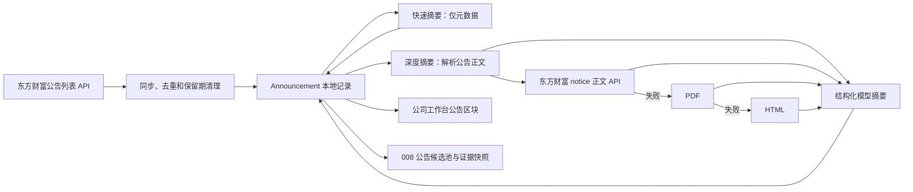

# 006_公告导入与摘要

> 当前实现基线：2026-08-17。本文只描述现行行为、接口合同、关键约束和回归基线，不保存逐次修改流水。

## 模块职责与边界

006 负责公司公告的来源同步、正文读取、结构化摘要、前端复核和向 008 提供官方披露证据。

- 当前自动同步按 Listing 选择 Provider：A 股使用东方财富公告，港股使用 HKEXnews，美股使用 SEC submissions/Archives。
- 公告保存在独立的 `announcements` 表中，不复制成 007 的普通 `Evidence`。
- 单条公告只保留当前摘要，不维护摘要版本历史。
- 公告摘要是研究材料，不替代原文；前端保留本地公告 ID 和来源链接。
- 006 不输出买卖、仓位、目标价或短期股价判断。

## 端到端数据流



## Announcement 数据模型

ORM 定义位于 `backend/app/db/models.py`。当前真实字段如下。

| 分组 | 字段 | 当前语义 |
| --- | --- | --- |
| 主键与归属 | `id`、`company_id`、可空 `listing_id` | `id` 是本地数据库自增主键；所有读取、删除、摘要和下游引用都按公司范围校验；多市场披露可绑定 Listing |
| 公告元数据 | `title`、`published_at`、`category` | 标题、UTC 发布时间和分类；深度摘要可修正 `category` |
| 来源 | `source`、`source_url`、`raw_url`、`source_document_id`、`document_type`、`filing_form`、`language`、`period_end` | 来源名、官方文档标识、表单/文档类型、语言、报告期和原文地址 |
| 正文 | `content`、`raw_content`、`content_type`、`content_source`、`content_fetched_at`、`raw_content_hash` | `content` 是旧数据回退；新正文及格式、来源、抓取时间和哈希均可审计 |
| 摘要核心 | `summary`、`key_facts`、`tags` | 关键词摘要、可复核事实和事项标签 |
| 影响与复核 | `impact_direction`、`sentiment`、`positive_impacts`、`negative_impacts`、`neutral_impacts`、`risk_tips`、`review_questions` | 模型结构化结果；当前 `sentiment` 与 `impact_direction` 写入同一值 |
| 摘要状态 | `summary_status`、`summary_model_name`、`summary_prompt_version`、`summarized_at` | 处理状态、实际摘要来源、prompt 版本和摘要时间 |
| 兼容字段 | `importance_score` | 公告摘要流程不再计算重要性，写回时固定清空为 `None` |
| 追踪 | `created_at` | 创建时间；当前模型没有 `updated_at` |

以下字段目前不存在，不应在代码或文档中假定可用：

- 没有 `summary_mode`、`summary_facts`、`summary_tags` 字段。
- 公告模型输出中的 `confidence`、`requires_review` 和输出 `source_url` 目前只参与当次校验或归一化，不持久化到 `Announcement`。

## ID 与来源标识

需要区分两类标识：

- `Announcement.id`：本地数据库 ID，例如前端显示 `ID #1206`。API 路径、删除、单条摘要、008 引用都使用这个 ID。
- `source_document_id`：来源文档稳定标识。东方财富新记录保存 `art_code`，HKEX 保存文档 ID，SEC 保存 accession/form 对应标识；旧记录仍可从 URL 回退解析。

去重顺序为：

1. 优先匹配 `(company_id, source, source_document_id)`。
2. 其次匹配同一公司下完全相同的 `source_url`。
3. 最后回退匹配 `(company_id, title, published_at)`。

## 公告同步

### 来源读取

`EastmoneyAnnouncementClient` 请求：

- 列表接口：`https://np-anotice-stock.eastmoney.com/api/security/ann`
- 参数包括 `ann_type=A`、股票代码、页码和分页大小。
- 当前仅支持 6 位 A 股代码，允许 `.SH`、`.SS`、`.SZ` 后缀。
- 标题、`art_code`、发布时间任一缺失时，该来源数据被视为异常。
- 分类取东方财富 `columns[0].column_name`，缺失时使用“其他”。
- 详情页生成规则：`https://data.eastmoney.com/notices/detail/{stock_code}/{art_code}.html`
- PDF 生成规则：`https://pdf.dfcfw.com/pdf/H2_{art_code}_1.pdf`

时间范围按当前 UTC 时间减去 `years`，并归一到当天 00:00:00。翻页在到达时间边界、来源总数、短页、结果数量上限或安全页数上限时停止。

### 入库与清理

同步流程只对三类结果计数：

- `created`：本地不存在，创建新公告。
- `updated`：只用于修复已误存东方财富页面壳的历史公告。
- `skipped`：公告已存在且不是已知坏数据，不覆盖已有元数据、正文或摘要。

历史页面壳记录在再次同步时会完整重置：清空 `content/raw_content`、摘要、事实、标签、影响、风险、模型名、prompt 版本和摘要时间，并把 `summary_status` 恢复为 `unprocessed`，同时刷新来源 URL 和公告元数据。

同步完成后会对该公司的全部公告执行两次清理：

1. 删除早于本次回溯起点的公告。
2. 按 `published_at desc, id desc` 只保留最新配置数量。

这里的清理条件不区分来源，因此手工或其他来源写入 `announcements` 表的记录也可能被回溯期和保留数量规则删除。

## 正文读取

实现位于 `backend/app/data_sources/announcement_content.py`。默认单次请求超时 20 秒，最多读取 8 MB。

### 读取优先级

1. 从 `source_url/raw_url` 提取东方财富 `art_code`。
2. 优先请求正文接口 `https://np-cnotice-stock.eastmoney.com/api/content/ann`，参数为 `art_code`、`client_source=web`、`page_index`。
3. 正文接口失败后，按 `raw_url`、`source_url` 顺序回退，通常即 PDF 后 HTML。
4. 所有来源都失败时，返回聚合后的读取错误。

正文接口会合并分页 `notice_content`，默认安全上限为 80 页。PDF 使用 `pypdf`，最多提取前 80 页。HTML 优先只读取 `id="notice_content"` 容器；没有该容器时读取可见文本并跳过 `script/style/noscript`。

### 页面壳识别

历史故障的根因是把东方财富详情页导航和数据中心页面壳当成正文。后端现在按以下规则识别坏内容：

- 命中“公告正文 _ 数据中心 _ 东方财富网”等已知页面壳标记；
- 同时没有“证券代码”“公告编号”“本公司及董事会”“重要内容提示”“特此公告”等正文标记。

命中页面壳后：

- 深度摘要不信任已存 `raw_content/content`，会重新抓取。
- 深度批量候选查询会重新纳入该公告。
- 再次同步会清空坏正文和由其生成的旧摘要。

当前没有单独保存“本次正文来自 notice API、PDF 还是 HTML”及抓取时间。可追溯地址仍使用公告自身的 `source_url/raw_url`。

## 摘要模式与状态

### 快速批量摘要

`POST .../summarize-all` 是纯元数据流程：

- 不下载正文，不调用模型网关。
- 使用标题、分类、发布时间、来源和来源链接生成关键词摘要。
- 摘要格式为“类别：...；性质：...；影响：未知；正文：未读取”。
- `impact_direction="unknown"`，`requires_review=true`，并写入原文复核问题。
- `raw_content` 保持为空。
- `summary_model_name="metadata_keyword"`。
- 快速批量会排除已有深度摘要；前端调用时 `only_missing=false`，因此可重新生成已有快速摘要。

### 单条与批量深度摘要

深度摘要的正文决策顺序是：

1. 若 `raw_content` 或兼容字段 `content` 已有非空且不是页面壳的内容，直接复用。
2. 否则调用正文读取器。
3. 正文成功时按配置截断后调用结构化模型。
4. 正文读取失败或返回空文本时，不抛出整条失败，而是降级成 `metadata_keyword` 快速摘要。
5. 模型未配置、模型请求失败或结构化输出校验失败时，摘要状态变为 `failed`。

因此，“点击深度摘要”是一次深度尝试，不保证最终一定是深度结果。正文读取失败时接口仍可成功返回，但 `summary_model_name` 会是 `metadata_keyword`，前端应显示为“已快速摘要”。

深度批量只选择以下公告：

- `summary_model_name` 为空；
- `summary_model_name="metadata_keyword"`；
- 或已有非 `metadata_keyword` 模型名，但正文仍被识别为历史页面壳。

服务层再次检查已深度摘要状态，正常深度结果会返回 `skipped` 而不重复调用模型。

### 状态语义

`summary_status` 的存储值包括：

| 状态 | 含义 |
| --- | --- |
| `unprocessed` | 尚未摘要，或同步修复坏数据后已重置 |
| `processing` | 单条深度摘要已开始；开始前会先提交该状态 |
| `summarized` | 摘要已写回；快速和深度都使用这个值 |
| `failed` | 模型或处理异常 |

快速与深度不能只看 `summary_status` 区分，实际判定规则是：

- `summary_model_name="metadata_keyword"`，或只有 `summary`：快速摘要。
- `summary_model_name` 非空且不等于 `metadata_keyword`：深度摘要。
- 前端还会检查页面壳标记，页面壳旧记录不显示为有效深度摘要。

## 模型输入、输出与持久化

### 模型输入

深度摘要 prompt 版本为 `announcement_summary_keywords_v3`，输入包括：

- 公司：`id/ticker/exchange/name/industry/description/tags`
- 公告：`id/title/published_at/category/source/source_url/raw_url/summary_status`
- 公告正文和 `content_truncated`

正文默认最多 12,000 字符；超长时取头部 70% 和尾部 30%，中间插入截断提示。

### 模型输出合同

Pydantic 要求模型输出合法 JSON，字段为：

`summary`、`key_facts`、`category`、`impact_direction`、`confidence`、`positive_impacts`、`negative_impacts`、`neutral_impacts`、`risk_tips`、`review_questions`、`tags`、`requires_review`、`source_url`。

主要约束：

- `impact_direction` 只能是 `positive/neutral/negative/mixed/unknown`。
- `key_facts` 最多 12 条，只能写正文可复核事实。
- 各影响、风险和复核问题最多 8 条；标签最多 12 条。
- prompt 要求摘要使用中文关键词格式，推荐“类别；性质；影响”，不输出交易建议或重要性分数。
- 配置层实际摘要长度上限默认 120 字符；模型摘要过长时会重建为标准三段式，而不是保留长段落。
- “待复核、其他、公告、公司公告、搜索线索、智能摘要”等泛化标签会被删除。
- 标题和分类的确定性关键词规则可修正模型分类并补充标签，例如财报、业绩预告、监管问询、诉讼、并购重组、控制权变化、会计口径、分红、回购、融资、重大合同、关联交易、担保、管理层变化、股权激励和治理事项。

### 实际写回

当前会写回：

- `raw_content`，仅正文成功读取或已有有效正文时；
- `summary/key_facts/category/impact_direction/sentiment`；
- 三类影响、`risk_tips/review_questions/tags`；
- `summary_status="summarized"`、模型名、prompt 版本和摘要时间。

当前不会写回模型的 `confidence`、`requires_review` 和输出 `source_url`。这三个字段不能作为后续模块已经持久化的证据使用。

## 摘要历史策略

公告不创建独立摘要运行历史：

- 每次单条摘要（深度批量会逐条调用）和快速批量摘要都会删除该公司旧的 `AnalysisRun(run_type="announcement_summary")`。
- 数据库迁移启动时也会清理旧公告摘要运行。
- 当前摘要接口返回的 `run_id` 始终为 `None`。
- 重做摘要直接覆盖当前 `Announcement` 字段。

## API 合同

| 方法 | 路径 | 关键参数与行为 |
| --- | --- | --- |
| `GET` | `/api/companies/{company_id}/announcements` | `limit` 默认 20、最大 50；按发布时间倒序分页 |
| `POST` | `/api/companies/{company_id}/announcements/sync` | `years` 可选 1-10；省略时读运行参数；返回 fetched/created/updated/skipped/pruned/errors |
| `POST` | `/api/companies/{company_id}/announcements/{announcement_id}/summarize` | 公司范围内按本地 ID 做单条深度尝试 |
| `POST` | `/api/companies/{company_id}/announcements/summarize-all` | 快速批量；支持 `limit/only_missing/include_failed`，并排除深度摘要 |
| `POST` | `/api/companies/{company_id}/announcements/summarize-all-deep` | 深度批量；默认最多 50 条候选 |
| `DELETE` | `/api/companies/{company_id}/announcements/{announcement_id}` | 公司范围内删除本地公告 |

批量响应提供 `requested/processed/remaining/succeeded/failed/status/items`。每条 item 包含 `announcement_id`、值为 `success/failed/skipped` 的 `status`、当前公告快照，以及可选 `error/error_type`。批次只要有部分失败即为 `partial`，全部失败为 `failed`。

错误映射：

- 不支持的证券代码：HTTP 400。
- 公告列表来源失败：HTTP 502。
- 单条深度摘要模型未配置：HTTP 400。
- 单条模型请求或输出校验失败：HTTP 502。
- 深度批量的单条异常保留在 item 中，不中断其他公告。

## 前端行为

公司工作台一次加载最多 50 条公告。公告卡片显示：

- 标题、发布日期、本地 `ID #...`、分类、摘要状态、来源和影响方向；
- 最多 8 个已清洗标签；
- `source_url` 的“查看来源”链接；
- 当前摘要和最多 4 条 `key_facts`；
- 单条深度摘要、删除操作。

顶部提供“一键快速摘要”“一键深度摘要”“搜索公告”。“搜索公告”是按所选 Listing 调用已注册 DisclosureProvider，不是本地关键字搜索；A 股使用东方财富，港股使用 HKEXnews，美股使用 SEC。

工作台有明确 Listing 时同步请求携带 `listing_id`；能力 blocked/unavailable 时按钮禁用并显示具体原因。公告卡片在多市场字段存在时同时展示 filing form、document type、披露语言和 period end，原始来源链接保持可访问；旧 A 股记录字段为空时按兼容方式展示。

当前前端固定传 `years=1` 并加载/处理最多 50 条。因此即使后端参数 `announcement_lookback_years` 被改为其他值，从这个按钮发起的同步仍使用 1 年；只有 API 调用省略 `years` 时才使用运行参数。这个差异需要后续统一。

前端展示状态优先使用 `summary_model_name` 推导；`summary_status` 只作为未识别情形的回退。摘要后会先用批次返回项更新本地列表，再重新读取公告列表。

## 进入 008 的公告证据

### 候选与排序

008 先按发布时间倒序读取最近 `analysis_announcement_pool` 条公告，默认候选池 80 条；由于 006 当前最多保留 50 条，实际通常不会达到 80 条。

进入排序前，会过滤标题、摘要、`key_facts` 或 `tags` 中命中“当前价格、历史价格、目标价、市值、持仓成本、估值倍数”等价格敏感文本的公告。

剩余公告按以下元组倒序排序：

```text
(deep_summary_rank, importance_score, published_at)
```

- `deep_summary_rank=1`：`summary_model_name` 非空且不是 `metadata_keyword`；否则为 0。深度摘要优先级高于后面的所有分数和日期。
- `importance_score` 是 008 临时排序分，不是 Announcement 的同名数据库字段：优先分类 `+0.26`，会计关键词 `+0.24`，重大事项关键词每个 `+0.04` 且上限 `0.22`，有摘要 `+0.06`。
- 同层级、同分数时按发布时间优先。
- 最终默认截取 20 条。

008 的深度优先判断当前只检查 `summary_model_name`，不会再次调用 006 的页面壳识别。因此历史坏记录应先通过同步或深度摘要修复，再运行分析师视角。

### 传给分析师的确切字段

每条选中公告只传：

```json
{
  "id": 1206,
  "title": "公告标题",
  "published_at": "2026-08-07T00:00:00+00:00",
  "category": "控制权变化",
  "summary": "最多 360 字符的摘要",
  "key_facts": ["最多 6 条事实"],
  "tags": ["标签"]
}
```

不会传给分析师：`raw_content/content`、`source/source_url/raw_url`、`summary_model_name`、`summary_status`、`impact_direction/sentiment`、三类影响、风险提示和复核问题。

`key_facts` 和 `tags` 不只是展示字段：它们参与 008 的来源覆盖矩阵和公司特征文本；分析师规则可以通过 `announcement_ids` 引用公告，本地 ID 必须存在于本次快照中。当前会计事件检测对公告主要读取标题、分类和摘要，尚未直接读取 `key_facts/tags`。

008 的公告数据置信度把“存在 summary”视为已摘要，因此快速摘要和深度摘要都会计入摘要覆盖率；深度摘要的优势目前体现在候选排序和事实质量，不是单独的置信度加分项。

## 运行参数

| 参数 | 当前默认值 | 实际作用 |
| --- | --- | --- |
| `data_sampling.announcement_lookback_years` | 1 年 | API 未显式传 `years` 时的同步回溯期；当前前端按钮固定覆盖为 1 |
| `data_sampling.announcement_retention_limit` | 50 条 | 来源读取上限和同步后本地保留上限 |
| `data_sampling.announcement_page_size` | 50 条/页 | 东方财富公告列表分页大小，客户端硬限制 1-100 |
| `data_sampling.announcement_max_pages` | 200 页 | 列表翻页安全上限，客户端硬限制 1-500 |
| `data_sampling.announcement_model_chars` | 12,000 字符 | 深度摘要正文输入上限 |
| `data_sampling.announcement_head_ratio` | 0.70 | 超长正文头部比例，剩余部分取尾部 |
| `data_sampling.announcement_keyword_summary_chars` | 120 字符 | 最终摘要长度上限 |
| `analyst_engine.model_temperatures.announcement` | 0.10 | 深度摘要模型温度 |
| `data_sampling.analysis_announcement_pool` | 80 条 | 008 排序前公告候选池 |
| `data_sampling.analysis_announcement_items` | 20 条 | 008 最终公告快照数量 |
| `data_sampling.analysis_excerpt_chars` | 360 字符 | 传给 008 的单条公告摘要截断长度 |
| `analyst_engine.announcement_ranking` | 类别 0.26、会计 0.24、关键词 0.04/个且上限 0.22、摘要 0.06 | 008 同一深度层级内的排序分 |

参数来自当前运行配置快照。正文有效性识别、错误页排除、公司范围 ID 校验、价格敏感过滤和摘要不输出交易建议属于结构性约束，不提供普通配置开关。

## 已知限制与维护注意

- 扫描 PDF、图片型公告和复杂表格可能无法提取有效文本；当前没有 OCR。
- 正文来源 URL、抓取时间、正文哈希和声明的 content type 已持久化；当前仍没有独立 OCR 状态字段，扫描 PDF 需通过失败/人工复核语义表达。
- 单条“深度摘要”正文失败时会静默降级为快速摘要，前端操作成功文案仍写“已生成单条深度摘要”，需要以后改成按返回模型名提示。
- 同一来源且 `source_document_id` 相同的已存在公告会刷新来源权威元数据（标题、分类、表单、语言、报告期和 URL），同时保留本地已有正文与摘要；仅按 URL 或标题回退匹配的旧记录仍采用兼容更新边界。
- 新 Provider 同步清理按来源与 Listing 分区；只有旧注入式 A 股兼容客户端继续保留公司级清理语义。
- `confidence/requires_review` 未持久化，当前只能通过 `review_questions`、模型名和正文是否存在间接判断质量。
- 008 不接收公告来源链接和原文，分析师只能依据压缩后的摘要、事实和标签；人工复核仍需回到 006 前端。
- 前端和后端的页面壳判断并非完全同一实现：前端只检查标记字符串，后端还会排除含正文标记的情况。

## 014 多市场披露口径（2026-08-21）

- `Announcement` 已增加可空 `listing_id`、`source_document_id/document_type/filing_form/language/period_end/content_type/content_source/content_fetched_at/raw_content_hash`。
- 去重优先使用来源与文档 ID；新 Provider 路径的时间和数量清理按来源及 Listing 分区，旧注入式 A 股测试客户端保留原公司级清理语义以维持兼容。
- SEC submissions 已用 Apple 离线固定样本验证 10-K/10-Q/8-K/DEF 14A、amendment、Archives 主文档 URL、英文语言和 accession 溯源。Archives HTML 使用同一 SEC 声明 User-Agent、限速和文本缓存客户端；解析排除 script/style/noscript 与 inline XBRL `ix:hidden`，成功抓取后持久化 `content_source/content_fetched_at/raw_content_hash`。
- 港股已注册 HKEXnews Title Search Provider，固定样本覆盖年度/中期/翌日披露、中英文文档去重、文档 ID、语言、报告期和 PDF URL。通用正文读取器使用 pypdf 提取文本型 PDF；腾讯垂直测试以真实 PDF 字节验证正文写入 `raw_content`，并冻结 `content_source/content_fetched_at/raw_content_hash`。扫描件提取为空时仍明确进入 OCR/人工复核缺口，不伪造正文。

2026-08-22 SEC 标题与前端展示复核：SEC submissions 通常提供的是官方 filing form、报告期、披露日、accession 和主文档路径，并没有交易所公告式的独立标题。`10-Q` 表示季度报告，`10-K` 表示年度报告，`8-K` 表示重大事项报告，`20-F` 表示境外发行人年度报告，`6-K` 表示境外发行人临时报告，`DEF 14A` 表示股东大会委托书；`/A` 表示修订版。Provider 现将这些事实组合为“季度报告（10-Q） · 报告期截至 2026-06-27”等可读标题，并在再次同步时刷新旧 form-only 标题，原始 form、accession 和 URL 不变，已有摘要/正文也不丢失。前端同时把历史快速摘要中的 `quarterly_report`、`sec_edgar`、`en-US` 和旧 form-only 标题转换为中文显示，不修改后端存量英文合同。

Apple 真实同步共读取最近 13 条 SEC 披露并刷新 13 条元数据；浏览器桌面与 390px 视口确认标题、分类、表单、语言和摘要均为可读中文，长 Archives URL 可在卡片内断行，不产生页面横向滚动。离线测试覆盖标题生成和“刷新权威元数据但保留摘要”，前端回归覆盖旧缓存展示；本轮总验证为后端 `244 passed`、前端 `62 passed`。

## 关键回归基线

以下是正文读取故障修复时验证过的真实样例，用于以后排查“浏览器能看正文、摘要却说读不到”的回归。它们是人工 smoke baseline，不是固定离线测试数据。

- 贵州茅台 `AN202607171827064564`：正文应能读到提价事项及 `1539 -> 1639`、`1269 -> 1369` 等数字，不能只得到东方财富页面导航。
- 五粮液 `AN202608061827714630`：正文应能读到五粮液集团增持计划、累计增持股数、比例和金额。
- 五粮液 `AN202608031827590547`：正文应能读到股份回购进展，不应仅生成“PDF 链接存在、正文未披露”的元数据摘要。

自动测试覆盖的关键行为包括：notice API 正文读取、HTML 回退、页面壳重抓、同步重置坏摘要、快速摘要不调用模型、深度批量跳过有效深度摘要、批次进度字段、008 深度摘要优先，以及 `key_facts/tags` 进入分析师快照。

## 关键文件

- 数据模型与迁移：`backend/app/db/models.py`、`backend/app/db/migrations.py`
- 公告列表来源：`backend/app/data_sources/eastmoney_announcements.py`
- 正文读取：`backend/app/data_sources/announcement_content.py`
- 同步与候选查询：`backend/app/services/companies.py`
- 摘要服务：`backend/app/services/announcement_summary_service.py`
- 摘要 prompt 与 schema：`backend/app/analysis/prompts/announcement.py`、`backend/app/schemas/announcement_summary.py`
- API：`backend/app/api/routes/companies.py`、`backend/app/schemas/company.py`
- 008 下游选择：`backend/app/services/analyst_service.py`
- 前端：`frontend/src/services/api.ts`、`frontend/src/app/CompanyWorkspaceView.tsx`
- 回归测试：`backend/app/tests/test_companies.py`、`backend/app/tests/test_analysis.py`、`frontend/src/tests/App.test.tsx`
