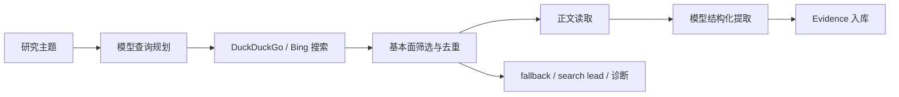

# 007_外部信息智能搜索与证据库

## 模块职责

007 补充公司公告之外的外部基本面证据。它负责查询规划、网页搜索、候选筛选、正文快照、模型结构化提取、证据复核和失败诊断。

## 数据流

## 当前能力

- 统一 OpenAI-compatible 模型网关，支持配置状态和 smoke test。
- 模型生成搜索计划，复合搜索提供方合并多个来源。
- 过滤股价、技术分析、行情页、泛化条目和公司公告重复内容。
- 每次搜索最多创建 10 条证据。
- 对 A 股搜索提供多级 fallback，可复用 006 已读取的本地公告正文进行分析。
- 无法完成正文与模型分析时可创建 `search_lead`，明确标记为线索而非已分析证据。
- 支持用户手动粘贴外部文本，调用 007 Evidence 模型结构化为 `model_analyzed` Evidence。
- 保存搜索诊断，包括候选数、过滤原因、提供方错误和 fallback 结果。
- 支持人工复核、备注、使用范围和单条删除。

## Evidence 结构

- 来源：`title`、`url`、`source_name`、`source_type`、`published_at`
- 内容：`summary`、`key_facts`、`raw_snapshot`
- 判断：`impact_direction`、`importance_score`、`credibility_score`
- 边界：`price_sensitive`、`use_scope`
- 状态：`analysis_status`、`analysis_note`、`requires_review`、`reviewed_at`
- 追踪：`company_id`、`created_at`、`updated_at`

`analysis_status=model_analyzed` 表示已经通过模型结构化分析；`search_lead` 只代表值得后续人工打开的搜索线索。

## API

| 方法 | 路径 | 作用 |
| --- | --- | --- |
| `GET` | `/api/evidence/model-config` | 查看模型配置状态 |
| `POST` | `/api/evidence/model-smoke-test` | 测试模型网关 |
| `POST` | `/api/companies/{company_id}/evidence/search` | 搜索并入库外部证据 |
| `POST` | `/api/companies/{company_id}/evidence/import-text` | 手动粘贴文本并结构化为外部证据 |
| `GET` | `/api/companies/{company_id}/evidence` | 读取公司证据 |
| `GET` | `/api/evidence/{evidence_id}` | 读取证据详情 |
| `POST` | `/api/evidence/{evidence_id}/review` | 标记复核 |
| `DELETE` | `/api/evidence/{evidence_id}` | 删除证据 |

## 已新增：手动文本导入

007 外部信息模块已新增“自主导入文字内容”能力：用户粘贴一段来源文本、可选标题、来源名称、来源链接、发布日期和备注，后端复用当前配置好的模型网关，把这段文本识别为结构化 Evidence。

实现设计：

- 新增 API：`POST /api/companies/{company_id}/evidence/import-text`。
- 入参字段建议：`title`、`content`、`source`、`source_url`、`published_at`、`source_type`、`notes`、`requires_review`。
- `content` 为必填，设置长度限制和截断策略；`source_url` 可选但建议提供，便于复核。
- 后端不联网、不搜索，只把用户文本作为 `manual_text_import` 输入快照交给 Evidence 模型。
- 模型仍输出标准 `EvidenceExtractionOutput`，复用现有 Pydantic 校验、价格敏感识别、公告重复过滤、use_scope 规则和入库逻辑。
- 成功时创建 `Evidence`，默认 `analysis_status="model_analyzed"`、`requires_review=true`、`raw_snapshot.import_mode="manual_text_import"`。
- 采用严格失败策略：模型未配置、模型失败、模型输出非法、模型返回空证据或全部被过滤时不入库，返回清晰错误并记录 failed run。
- 创建 `AnalysisRun`，`run_type="evidence_import_text"`，`input_snapshot.mode="manual_text_import"`，成功 result 记录 created count 和 evidence ids，失败 result 记录错误。
- 前端 Evidence 分区已新增“导入文本”内联表单；提交成功后刷新 Evidence 列表并显示新 Evidence ID。
- 008 仍只读取已入库 Evidence，因此手动导入并成功结构化的证据可以自然进入后续分析师视角；用户删除后不会再进入后续分析。

质量边界：

- 用户粘贴内容不是系统自动验证过的原始来源，默认 `requires_review=true`。
- 如果没有 `source_url`，可信度应受限，`analysis_note` 必须说明缺少可复核链接。
- 模型不能把用户文本之外的信息补造成事实；prompt 需要明确“只基于用户提供文本抽取”。
- 行情、目标价、荐股、短线交易观点等内容仍应按 007 规则标记为价格敏感或过滤，不进入默认基本面 Evidence。

验证结果：

- `cd backend; .\.venv\Scripts\python.exe -m pytest app/tests/test_evidence.py`：33 passed。
- `cd backend; .\.venv\Scripts\python.exe -m ruff check app/services/evidence_service.py app/api/routes/evidence.py app/schemas/evidence.py app/tests/test_evidence.py`：All checks passed。
- `cd backend; .\.venv\Scripts\python.exe -m pytest`：175 passed。
- `cd backend; .\.venv\Scripts\python.exe -m ruff check .`：All checks passed。
- `cd frontend; npm test -- --run App.test.tsx`：48 passed。
- `cd frontend; npm run build`：通过。

运行排查记录：

- 用户反馈导入文本后显示 `not found` 且未新增条目。排查发现当前前端代理连接的运行中后端 OpenAPI 没有 `/api/companies/{company_id}/evidence/import-text`，属于旧后端路由表未重启或前端代理端口未对齐。
- 当前可用后端端口为 `8004`，OpenAPI 已包含 `import-text` 路由；已重启 `5173` 和 `5174` 前端并设置代理到 `8004`。
- 通过 `POST http://127.0.0.1:5173/api/companies/1/evidence/import-text` 和 `POST http://127.0.0.1:5174/api/companies/1/evidence/import-text` 空 JSON 验证均返回 `422` 校验错误而非 `404`，证明路由已被前端代理正确命中，且未实际入库。
- 用户随后反馈“模型未从手动导入文本中生成可入库外部证据”。排查最新 `evidence_import_text` run 发现输入为“贵州茅台披露半年报，香港中央结算退出前十大股东名单”等股东结构事实；模型受基础规则“不要把常规半年报/公告内容结构化为外部信息”影响，过度保守返回空证据。
- 已调整手动导入 prompt：如果用户文本包含股东结构、前十大股东变化、机构持股变化、治理结构、经营数据、产能、渠道、库存、监管、诉讼、环保、食品安全或社会责任等具体事实，即使引用年报、半年报、季报或公告，也应抽取为 `requires_review=true` 的 Evidence，并说明需追到原始披露复核。
- 已为 `manual_text_import` 增加窄范围公告重复过滤例外：仅当模型输出来自手动导入且命中具体基本面事实关键词时，允许绕过公告重复过滤；搜索自动入库仍保持原有公告重复过滤。
- 新增回归测试 `test_import_text_evidence_allows_shareholder_fact_from_report_quote`；验证 `app/tests/test_evidence.py` 为 34 passed，`ruff check app/services/evidence_service.py app/tests/test_evidence.py` 通过。
- 使用失败 run 的原始输入真实重试，生成成功 run `#1580`，新增 Evidence `#40`。

## Goal 模式 Prompt：手动文本导入

已为后续 goal 模式整理一版可直接执行的 prompt，目标是实现 007 外部信息模块的“自主导入文字内容并结构化为 Evidence”能力。Prompt 要求覆盖后端 API、模型抽取、入库状态、前端入口、删除后不再传给 008、测试验证和本文档更新。

## AnalysisRun

每次证据搜索写入 `AnalysisRun`，保存查询、输入快照、结构化结果、状态、错误信息和置信度。该记录用于追踪“为什么没有证据”以及模型或提供方在哪一步失败。

## 前端行为

- Evidence 分区提供主题输入、搜索、模型配置状态和 smoke test。
- Evidence 分区提供手动文本导入表单，字段包括标题、来源名称、来源链接、发布日期、来源类型、正文内容和备注。
- 结果展示 Evidence ID、来源、摘要、事实、方向、评分、复核状态和使用范围。
- `search_lead` 不展示伪造的影响方向或模型评分。
- 搜索失败展示结构化诊断；删除后重新读取证据列表。
- 手动导入成功展示“已导入 N 条外部证据：#id，运行记录 #run_id”；失败展示后端错误。

## 质量边界

- 外部网页可用性受反爬、JS 渲染、PDF 和网络波动影响。
- 通用搜索提供方不保证结果稳定或完整。
- 搜索线索不能直接作为 008 的高置信证据；需要正文和模型分析或人工复核。
- 股价和技术面内容在本模块被主动排除，以保护后续 price-blind 链路。

## 关键文件

- `backend/app/analysis/model_gateway.py`
- `backend/app/data_sources/web_search_provider.py`
- `backend/app/services/evidence_service.py`
- `backend/app/api/routes/evidence.py`
- `frontend/src/app/CompanyWorkspaceView.tsx`
