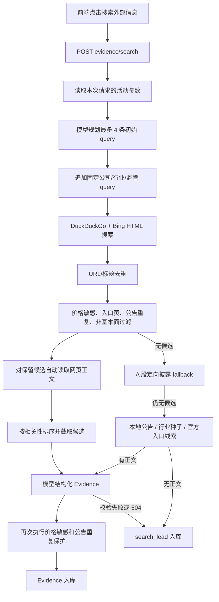

# 007_外部信息智能搜索与证据库

> 当前实现基线：2026-08-17。本文记录现行代码路径、接口合同、数据边界和已知缺口，不保存逐次修改流水。

## 模块定位

007 负责补充 006 公司公告之外的外部基本面信息，并把可用内容落为统一的 `Evidence`。它覆盖查询规划、网页搜索、候选过滤、正文读取、模型结构化、手工文本导入、失败诊断和证据删除。

边界如下：

- 007 面向政策、监管、政府公开数据、行业供需、渠道库存、合规、诉讼、环保、食品安全和其他可复核的外部基本面事实。
- 常规年报、季报、分红、回购、会议决议等公司公告优先由 006 管理，007 自动搜索会主动过滤这类重复内容。
- 行情、股价、目标价、评级、资金流、技术分析和短期交易观点不进入默认基本面 Evidence。
- 搜索成功后自动执行模型结构化，没有独立的“再次分析”按钮。
- 用户也可以直接粘贴一段文字，由同一 Evidence 模型结构化后入库。

## 当前用户行为

- 点击“搜索外部信息”后，前端以公司名称和行业作为关键词发起搜索；搜索、正文读取、模型分析和入库在同一次请求内完成。
- 搜索结果有可读正文时，模型优先依据正文生成摘要、事实、影响、重要性和可信度。
- 只有标题或摘要、正文读取失败，或者模型结构化失败时，系统才可能保留 `search_lead`。
- Evidence 标题直接展示原始标题或模型标题，不再添加“公司名 本地公告追溯线索：”之类前缀。
- 前端每条 Evidence 显示 `#id`；有 `source_url` 时来源名称可点击并在新窗口打开。
- 删除按钮直接硬删除 Evidence。删除后未来新建的 008 分析不会再读取该条记录。
- 手工导入成功后会显示新 Evidence ID 和本次 `AnalysisRun` ID。

## 自动搜索主链路



### 1. 请求与默认值

`EvidenceSearchRequest`：

| 字段 | 规则 | 当前前端行为 |
| --- | --- | --- |
| `keywords` | 最多 10 个，去空格并去重 | 传入公司名称和行业 |
| `max_results` | 可选，API 允许 1-10 | 前端不显式传值，由后端读取活动参数 |

当前活动参数 `data_sampling.external_search_default_results=5`。它表示每条 query 向每个搜索提供方请求的结果数，不是最终 Evidence 数量。

复合搜索提供方会合并 DuckDuckGo 和 Bing，因此一条 query 的原始返回数可能高于 `max_results`。系统最终还会跨 query 去重、过滤和排序。

### 2. 查询规划

- 模型使用 `QUERY_SYSTEM_PROMPT` 生成初始搜索计划，调用时要求最多 4 条 query。
- 如果查询规划模型失败、输出非法或未配置可用结果，系统改用规则生成的前 4 条 query，不会因查询规划失败直接终止。
- `_expand_queries` 会在模型 query 之后追加公司、证券代码、行业、监管、处罚、政策、公开数据、供需、渠道和库存等固定 query。
- 追加后的 query 当前没有总数量硬上限，因此一次搜索可能执行多条查询。

### 3. 搜索提供方

默认主搜索源：

- `DuckDuckGoHtmlSearchProvider`
- `BingHtmlSearchProvider`
- `CompositeWebSearchProvider` 负责合并和单 query 内去重，并记录各搜索源成功、失败和结果数。

实现使用搜索结果 HTML 页面，不依赖正式搜索 API。它容易受到搜索站点页面结构变化、限流、连接重置和地区网络环境影响。

### 4. 候选去重和过滤

跨 query 去重键为：优先使用 URL，没有 URL 时使用标题。相同 URL 只保留第一次出现的候选。

过滤顺序：

1. `price_sensitive`：行情、股价、目标价、评级、资金流、技术指标、情绪、交易异常波动、回购价格上限等。
2. `generic_entry`：官网入口、搜索入口、公告检索入口、首页等缺少具体事实的页面。
3. `company_disclosure_duplicate`：年报、季报、半年报、分红、回购、股东会、董事会、法律意见书、审计报告、投资者关系活动等 006 已覆盖内容。
4. `not_fallback_fundamental`：仅在定向 fallback 中启用，要求命中更窄的监管、处罚、合规、诉讼、公开数据、供需、库存、产量等主题。
5. `not_fundamental`：相关性评分小于等于 0。

相关性评分的当前规则：

- 官方来源域名加 2 分。
- 百度百科、Wikipedia、雪球、知乎等二手来源减 1 分，但不是一律硬过滤。
- 每命中一个基本面实质词加 1.2 分，最多 6 分。
- 标题或摘要命中公司名称、证券代码或行业词，每个加 2 分，最多 5 分。
- 没有命中任何基本面实质词时直接判为 0 分，即使来源是官方站点也不会仅凭域名进入模型。
- 没有公司相关词且既非官方来源又非明确行业材料时再减 1.5 分。

过滤原因会累计到 `AnalysisRun.result.search_stats.filtered_out_by_reason`。

### 5. 正文自动读取

正文读取发生在硬过滤之后、相关性排序截断之前。也就是说，系统会尝试读取所有通过过滤的候选，再按分数选择送模候选。

普通网页：

- `HttpWebPageSnapshotFetcher` 默认超时 8 秒，最多读取 900,000 字节。
- 支持 HTML、XHTML 和纯文本。
- 提取网页标题、description 和可读正文，跳过 script、style、noscript、svg、canvas、nav、footer。
- 普通网页抓取失败时保留原标题和 snippet，不会让整个搜索请求失败。

公告和 PDF：

- `AnnouncementAwareWebPageSnapshotFetcher` 识别东方财富公告详情、东方财富 PDF 和 `.pdf` URL。
- 东方财富公告优先从公告正文接口按 `AN...` 代码读取分页正文，避免只读到网页壳。
- 通用公告读取支持 HTML 和 PDF；PDF 使用 `pypdf`，最多解析前 80 页。
- 公告读取默认超时 20 秒、最多读取 8,000,000 字节。

正文以 `page_snapshot.content_excerpt` 传给模型。正常网页摘录上限由 `data_sampling.evidence_excerpt_chars` 控制，当前为 1,800 字符。

本地公告 deterministic fallback 的正文摘录目前硬编码为 1,800 字符，没有使用上述参数，这是现有实现差异。

### 6. 送模型候选和入库上限

通过过滤的候选按 `relevance_score` 倒序排列，最多取 `data_sampling.external_evidence_limit` 条送入 Evidence 模型。当前活动值为 10。

该参数在当前代码中同时影响：

- 自动搜索送模型候选上限；
- 自动搜索最终创建 Evidence 的上限；
- 手工文本导入一次最多创建 Evidence 的上限。

它不表示数据库总保留量，也不表示前端列表展示量，更不表示 008 最终采用量。

### 7. 模型结构化

模型必须返回 `EvidenceExtractionOutput`，顶层为 `{"evidences": [...]}`。每条 Evidence 必须包含完整字段，Pydantic 会校验标题、摘要、枚举、分数范围和列表格式。

模型规则：

- 优先依据 `page_snapshot.content_excerpt`，没有正文时才依据 title/snippet。
- 只能提取可由当前候选支持的事实，不得把标题扩写成未经支持的结论。
- 二手来源引用原始文件时必须 `requires_review=true`，并要求追到原始来源。
- 正常模型输出统一为 `analysis_status=model_analyzed`。

模型输出入库前还会执行第二层保护：

- 重新扫描标题、摘要、事实、标签和原始快照中的价格敏感词；命中后不入库。
- 再次过滤公告重复内容。
- 空 `use_scope` 会补为默认三个范围。

### 8. 模型失败处理

- 输出未通过 Pydantic 校验时，系统用温度 0 再修复一次。
- 修复仍失败，或者模型返回 HTTP 504 时，最多把前 5 个已筛选候选保存为 `search_lead`，运行状态为 `partial`。
- 其他模型网关错误直接把运行标记为 `failed` 并返回 502，不创建线索。
- 自动搜索模型合法返回空 `evidences`，或模型输出全部在入库保护层被过滤时，当前实现会以 `success + created=0` 完成；这一点与手工导入的严格失败策略不同，是现有设计缺口。

## 多级 fallback

fallback 只在主搜索过滤后没有可送模型候选时触发。

### 第一级：A 股定向披露搜索

- 使用 `AShareCompanyDisclosureSearchProvider`。
- 从东方财富公告源读取近 3 年、最多 50 条公告，按查询主题优先返回监管函、问询函、处罚、审计、诉讼、经营、产能等标题。
- 同时复用 DuckDuckGo/Bing 执行更窄的监管、处罚、食品安全、环保、合规、诉讼、行业产量和库存 query。
- fallback 候选还要通过更严格的 `FALLBACK_FUNDAMENTAL_PATTERNS`。

由于 007 会过滤 006 已覆盖的常规公告，定向披露源返回的年报、股东会、法律意见书等仍可能全部被过滤，这是预期边界，不代表搜索源完全没有返回结果。

### 第二级：确定性线索

主搜索和第一级 fallback 都无候选时，系统按以下优先级最多拼出 5 条线索：

1. `local_announcement`：扫描该公司 006 最近 80 条公告，挑选监管、重大事项、诉讼、环保、食品安全、安全生产、处罚、担保、关联交易、经营、产能、渠道等候选，最多 5 条。
2. `seed_source`：根据公司别名和行业生成市场监管总局、国家统计局、财政部、工信部、国务院等固定追溯线索。白酒公司额外扩展白酒、浓香型白酒、高端白酒、食品安全、市场监管、渠道库存等语义。
3. `final_search_lead`：上交所、巨潮、市场监管总局、国家统计局、工信部等通用官方入口。

本地公告标题保持原始标题，不增加“本地公告追溯线索”前缀。

如果本地公告已有可用 `raw_content/content`，或能现场读取到原文，系统把有 `content_excerpt` 的线索送模型，成功后生成 `model_analyzed` Evidence。没有正文的确定性线索不会伪造模型判断，而是保存为 `search_lead`。

## `analysis_status` 语义

当前只有两种状态：

| 状态 | 生成条件 | 字段可信边界 | 前端展示 |
| --- | --- | --- | --- |
| `model_analyzed` | 候选或手工文本已经通过模型结构化 | 有模型生成的摘要、事实、方向、重要性和可信度，仍可能要求人工复核 | 显示影响、重要性和可信度 |
| `search_lead` | 无正文的确定性线索，或模型校验失败/504 后保留的原始候选 | 只是追溯线索；固定使用 `unknown`、低分和 `requires_review=true`，不能视为已验证事实 | 显示“影响、重要性、可信度未完成模型分析” |

`search_lead` 当前固定使用：

- `impact_direction="unknown"`
- `importance_score=0.3`
- `credibility_score=0.4`
- `tags=["待复核", "搜索线索"]`
- `requires_review=true`
- 默认三个 `use_scope`

前端不会展示上述占位分数，但数据库中仍保存这些值用于结构兼容。

数据库迁移还会识别旧数据中“unknown + 0.3/0.4 低分 + requires_review + 兜底/搜索 snippet”这类历史记录，并把误标为 `model_analyzed` 的记录规范为 `search_lead`。

## 手工文本导入

接口：`POST /api/companies/{company_id}/evidence/import-text`。

### 输入

| 字段 | 规则 |
| --- | --- |
| `content` | 必填，20-20,000 字符；后端会压缩连续空白和换行 |
| `title` | 可选，最多 255 字符 |
| `source` | 可选，最多 160 字符 |
| `source_url` | 可选 |
| `published_at` | 可选 datetime |
| `source_type` | 默认 `web` |
| `notes` | 可选，最多 1,000 字符 |
| `requires_review` | schema 中存在，但服务当前无条件强制为 `true` |

### 处理规则

- 不联网、不搜索、不自动验证来源，只把用户文本交给 Evidence 模型。
- 送模型正文上限由 `manual_import_model_chars` 控制，当前 1,800 字符。
- 审计快照上限由 `manual_import_snapshot_chars` 控制，当前 3,600 字符。
- 模型只能使用用户文本，不得补造文本之外的事实。
- 股东结构、前十大股东变化、机构持股、治理、经营、产能、渠道、库存、监管、诉讼、环保、食品安全、资金占用、关联交易、担保和债务等具体事实，即使引用年报或公告，也允许作为待复核 Evidence 入库。
- 只有“公告发布了什么标题”、会议程序、分红回购、业绩预告或泛化入口而没有具体事实时，模型应返回空。
- 没有 `source_url` 时，可信度被封顶为 `analyst_engine.manual_import_credibility_cap`，当前 0.60，并在 `analysis_note` 中说明缺少可复核链接。
- 手工导入仍受价格敏感过滤；行情、荐股和技术分析不会入库。
- 成功记录统一为 `analysis_status=model_analyzed`、`requires_review=true`，`raw_snapshot.import_mode="manual_text_import"`。

### 失败策略

手工导入采用严格失败：

- 模型未配置、调用失败或输出非法：不入库。
- 模型返回空 `evidences`：返回“模型未从手动导入文本中生成可入库外部证据”。
- 模型输出全部被价格敏感或公告重复规则过滤：不入库。
- 无论成功失败都会创建 `run_type=evidence_import_text` 的 `AnalysisRun`。

当前前端在提交表单后立即清空输入，只要提交时正文非空，即使后端随后失败也不会恢复原文。这是现有交互缺口。

## Evidence 数据结构

数据库表：`evidence`。

| 字段 | 含义 |
| --- | --- |
| `id` | Evidence 主键，前端显示为 `#id` |
| `company_id` | 所属公司 |
| `source_type` | `policy`、`industry_news`、`company_news`、`public_data`、`regulatory`、`web` |
| `title` | 原始或模型生成标题，不加系统前缀 |
| `source` | 来源名称或域名 |
| `source_url` | 可点击原始链接，可为空 |
| `published_at` | 发布时间，可为空 |
| `summary` | 中文摘要 |
| `key_facts` | 可复核事实列表 |
| `impact_direction` | `positive`、`neutral`、`negative`、`mixed`、`unknown` |
| `importance_score` | 0-1，研究重要性 |
| `credibility_score` | 0-1，来源与内容可信度 |
| `tags` | 分类标签 |
| `requires_review` | 是否需要人工复核 |
| `price_sensitive` | 是否价格敏感；007 正常入库逻辑会跳过此类输出 |
| `use_scope` | `fundamental_analysis`、`analyst_view`、`intrinsic_valuation` 的组合 |
| `analysis_status` | `model_analyzed` 或 `search_lead` |
| `analysis_note` | 评分依据、来源限制、复核要求或 fallback 说明 |
| `raw_snapshot` | 搜索结果、网页正文摘录或手工导入审计快照 |
| `created_at` | 入库时间 |

当前表没有 `reviewed_at`、`updated_at`、软删除标记或 Evidence 级版本号。

## 复核与删除

### 复核

`POST /api/evidence/{evidence_id}/review` 目前只把 `requires_review` 改为 `false`：

- 不记录复核时间、复核人或复核备注。
- 不把 `search_lead` 转换成 `model_analyzed`。
- 不重新计算重要性、可信度或影响方向。
- 当前前端没有复核按钮，也没有显示 `requires_review`；该能力只存在于后端 API。

### 删除

`DELETE /api/evidence/{evidence_id}` 使用数据库硬删除：

- Evidence 行立即删除，前端随后重新读取列表。
- 后续新建 008 分析从当前 Evidence 表取数，因此不会再看到已删除证据。
- 已经生成的历史 `AnalysisRun.input_snapshot/result`、Memo 或其他历史快照不会被反向清洗；搜索运行中的 `created_evidence_ids` 也可能保留已删除 ID。这是审计历史，不会作为新分析的 Evidence 表输入。

## AnalysisRun 审计

自动搜索创建：

- `run_type="evidence_search"`
- `analyst_profile="evidence_search"`
- `run_version="007_v1"`
- `prompt_version="evidence_search_v1"`

手工导入创建：

- `run_type="evidence_import_text"`
- `analyst_profile="evidence_import_text"`

状态：

- `running`：请求处理中。
- `success`：模型正常完成，或自动搜索合法完成但创建数可能为 0。
- `partial`：保存了 fallback/search_lead，模型分析未完整完成。
- `failed`：请求失败且没有形成可返回结果。

搜索诊断主要字段：

| 字段 | 含义 |
| --- | --- |
| `queries/query_count` | 实际执行的 query |
| `provider_result_count` | 搜索源原始返回总数 |
| `deduped_result_count` | URL/标题去重后的数量 |
| `candidate_before_ranking_count` | 通过过滤、排序前的候选数 |
| `sent_to_model_count` | 最终送模型数量 |
| `model_candidate_limit` | 本次候选上限 |
| `filtered_out_count` | 被过滤总数 |
| `filtered_out_by_reason` | 各过滤原因数量 |
| `query_errors` | query 级搜索失败 |
| `provider_stats` | DuckDuckGo/Bing 等提供方状态 |
| `fallback_triggered/fallback_stage` | 是否触发 fallback 及当前阶段 |
| `local_announcement_lead_count` | 本地公告候选数 |
| `seed_source_lead_count` | 行业/官方种子线索数 |
| `final_search_lead_count` | 最终官方入口线索数 |
| `no_candidate_reason` | `provider_no_result`、`all_filtered` 或 `no_ranked_candidate` |

当前搜索 `AnalysisRun` 保存输入、查询、计数、错误、模型名、prompt 版本和新 Evidence ID，但不保存完整活动参数快照/哈希，也不直接保存全部原始搜索结果。可复核原始内容主要依赖 Evidence 的 `raw_snapshot`。

## API

| 方法 | 路径 | 作用 |
| --- | --- | --- |
| `GET` | `/api/evidence/model-config` | 查看模型 provider、base URL、model name、wire API 和 key 是否已配置；不返回 key |
| `POST` | `/api/evidence/model-smoke-test` | 验证模型连通性和 JSON 结构化能力，不创建 Evidence |
| `POST` | `/api/companies/{company_id}/evidence/search` | 自动搜索、读取正文、模型结构化并入库 |
| `POST` | `/api/companies/{company_id}/evidence/import-text` | 手工粘贴文本并结构化入库 |
| `GET` | `/api/companies/{company_id}/evidence` | 分页读取 Evidence，API 单页限制 1-10 |
| `GET` | `/api/evidence/{evidence_id}` | 读取 Evidence 详情 |
| `POST` | `/api/evidence/{evidence_id}/review` | 仅取消 `requires_review` |
| `DELETE` | `/api/evidence/{evidence_id}` | 硬删除 Evidence |

典型错误：

- 请求字段校验失败：422。
- 公司或 Evidence 不存在：404。
- 模型未配置：400。
- 模型输出非法、模型网关错误或没有可用候选：502。

## 前端实现

Evidence 面板当前包含：

- 模型配置状态：provider、base URL、model name、wire API、API key 是否配置。
- “模型自检”按钮。
- “搜索外部信息”按钮。
- 手工导入表单：标题、来源名称、来源链接、发布日期、来源类型、正文内容、备注。
- Evidence 总数和最近 10 条列表。
- 单条 Evidence 的来源类型、标题、发布时间、`#id`、状态、基本面标签、可点击来源、模型评分、摘要、分析说明和关键事实。
- 单条删除按钮。

当前没有：

- 自定义搜索主题/关键词输入框；搜索关键词固定来自公司名称和行业。
- Evidence 分页或“加载更多”；即使数据库超过 10 条，页面只显示最近 10 条，总数仍显示完整数量。
- 复核按钮和 `requires_review` 可视化。
- `use_scope`、tags、raw_snapshot 的展开查看。
- 将 `search_lead` 重新读取正文并升级为 `model_analyzed` 的单条操作。
- 删除确认弹窗。

列表排序为 `published_at desc nulls last, created_at desc`。没有发布时间的记录会排在有发布时间记录之后。

## 数据保留与重复

- Evidence 表没有公司级总保留上限，也没有自动清理逻辑；只要不删除会持续保留。
- API 列表单页最多 10 条，前端当前只取第一页。
- `external_evidence_limit` 只限制单次处理，不限制历史总量。
- 搜索结果只在单次运行内按 URL/标题去重；数据库入库前没有跨运行唯一性检查。重复点击搜索可能再次创建语义相同或 URL 相同的 Evidence。

## 传给 008 分析师的规则

008 每次新运行从当前 Evidence 表重新取数，不读取历史 007 运行结论作为替代数据源。

当前选择流程：

1. 统计公司 Evidence 总数。
2. 先按 `importance_score + credibility_score`、发布时间、创建时间、ID 倒序预取 `analysis_evidence_items * 3` 条。
3. 过滤 `price_sensitive=true`，并再次扫描文本中的价格敏感内容。
4. 最终按以下分数排序：

```text
外部证据排序分
= credibility_score * credibility_weight
+ importance_score * importance_weight
+ source_priority[source_type]
```

当前权重为可信度 0.50、重要性 0.50；来源加分为监管 0.20、公开数据 0.18、政策 0.16、普通网页 0.10、公司新闻 0.08、行业新闻 0.06。

5. 最多选 `data_sampling.analysis_evidence_items` 条，当前为 10。

直接写入分析师模型快照的每条外部证据字段只有：

- `id`
- `title`
- `published_at`
- `source_type`
- `summary`

在投影前，008 会用完整 Evidence 的 `key_facts`、tags、analysis_note、状态、可信度等构建 `fact_ledger`、来源覆盖矩阵、外部证据质量摘要和数据置信度，因此这些字段会间接影响分析，但不会以完整原始 Evidence 对象直接暴露给模型。

### `search_lead` 在 008 中的当前行为

- `search_lead` 没有被硬排除；只要排序进入前 10 条，就会进入分析师快照。
- `requires_review=true` 也不会阻止进入 008。
- 系统会在限制说明中写明它不能当作已验证事实。
- 外部证据质量分会按每条 `search_lead` 扣 0.04，最多扣 0.25。
- `search_lead` 当前默认包含 `intrinsic_valuation` use scope，因此也可能进入估值输入子集；这是当前实现的质量边界风险，后续更合理的方向是限制未分析线索的 use scope 或在 008 选择层硬过滤。

删除 Evidence 后，未来新运行不会选中它；旧分析运行快照仍保持生成当时的审计内容。

## 当前活动参数

活动来源：`backend/app/configuration/active_parameters.json`。007 API 每次请求读取当前活动配置并放入本次请求上下文，发布参数后不需要重启后端，后续新请求使用新值；未发布的前端编辑不会生效。

| 参数 | 当前值 | 实际作用 |
| --- | ---: | --- |
| `data_sampling.external_search_default_results` | 5 | 每条 query、每个 provider 默认请求候选数 |
| `data_sampling.external_evidence_limit` | 10 | 自动搜索送模上限、自动搜索入库上限、手工导入入库上限 |
| `data_sampling.analysis_evidence_items` | 10 | 008 单个分析师最终采用 Evidence 数，与 007 单次入库上限独立 |
| `data_sampling.evidence_excerpt_chars` | 1,800 | 普通搜索候选网页正文摘录上限 |
| `data_sampling.manual_import_model_chars` | 1,800 | 手工导入送模型正文上限 |
| `data_sampling.manual_import_snapshot_chars` | 3,600 | 手工导入审计快照正文上限 |
| `data_sampling.search_snippet_chars` | 500 | 搜索候选 snippet 截断；候选会以截断值送模型 |
| `data_sampling.search_title_chars` | 160 | 搜索候选标题截断；候选会以截断值送模型 |
| `analyst_engine.manual_import_credibility_cap` | 0.60 | 无来源链接手工证据可信度封顶 |
| `analyst_engine.model_temperatures.evidence_plan` | 0.20 | 搜索查询规划温度 |
| `analyst_engine.model_temperatures.evidence_extract` | 0.10 | Evidence 结构化温度 |

参数中心当前只对 `data_sampling` 数值做类型和有限数校验，没有为上述采样参数统一设置正数/合理上限校验；API 自身只对 `max_results` 和手工正文长度有明确边界。发布异常的负数或极大数可能造成切片、SQL limit、性能或模型输入问题，应在参数中心补充字段级范围校验。

## 已知设计债务

1. 自动搜索合法返回空模型结果时会显示成功但创建 0 条，应与手工导入一样返回明确诊断。
2. `search_lead` 当前可以进入 008 和 intrinsic valuation，仅通过文字提示和置信度扣分约束，不够严格。
3. Evidence 没有跨运行 URL/语义去重，重复搜索会累积重复记录。
4. 前端只显示最近 10 条，没有分页、筛选和详情展开。
5. 后端复核仅修改布尔值，前端没有复核入口，也没有复核审计字段。
6. 手工导入提交后立即清空表单，失败时用户文本无法自动恢复。
7. 搜索会在最终候选截断前读取所有通过过滤的网页，候选较多时请求延迟可能明显。
8. 007 `AnalysisRun` 没有保存本次活动参数快照和完整原始候选，重现一次搜索仍不充分。
9. 参数说明中的“搜索快照标题/摘要”实际上也影响送模上下文，文案应避免误写成仅影响审计展示。
10. 本地公告 fallback 的正文长度仍有硬编码，尚未完全统一到参数中心。

## 测试覆盖

`backend/app/tests/test_evidence.py` 当前覆盖：

- 手工文本成功导入、无 URL 可信度封顶、股东事实、模型未配置、价格敏感过滤和 API 校验。
- 正常搜索入库、模型配置、模型自检、Pydantic 校验失败、正文快照传模。
- 行情/技术分析、入口页、公司公告重复和非基本面过滤。
- DuckDuckGo/Bing 复合搜索、A 股披露 fallback、搜索源失败诊断。
- 官方线索、本地公告线索、白酒行业种子线索。
- 本地公告正文读取成功后自动升级为 `model_analyzed`。
- Evidence 复核、硬删除和 404。

`frontend/src/tests/App.test.tsx` 覆盖搜索、手工导入、列表刷新、ID/来源展示、`search_lead` 展示、删除成功/失败和模型自检。

## 关键文件

- `backend/app/services/evidence_service.py`：007 主业务、过滤、正文读取、fallback、入库和运行记录。
- `backend/app/analysis/prompts/evidence.py`：查询规划和 Evidence 结构化 prompt。
- `backend/app/data_sources/web_search_provider.py`：DuckDuckGo/Bing、A 股披露提供方和普通网页读取。
- `backend/app/data_sources/announcement_content.py`：东方财富正文接口、HTML/PDF 公告读取。
- `backend/app/schemas/evidence.py`：API 和模型结构 schema。
- `backend/app/api/routes/evidence.py`：007 API、活动参数上下文和错误映射。
- `backend/app/db/models.py`：`Evidence`、`AnalysisRun` 数据模型。
- `backend/app/services/analyst_service.py`：008 对 Evidence 的选择、投影和质量评分。
- `backend/app/configuration/active_parameters.json`：当前活动参数。
- `backend/app/configuration/parameter_copy.py`：参数中心中文名称和解释。
- `frontend/src/app/CompanyWorkspaceView.tsx`：Evidence 面板、搜索、导入、列表和删除交互。
- `frontend/src/services/api.ts`：前端 Evidence 类型和 API 封装。
