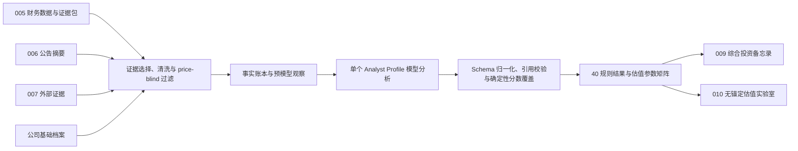

# 008_分析师视角引擎

## 1. 模块定位

008 将同一家公司、同一批已入库证据交给 10 个固定投资框架独立审视，输出结构化规则判断、风险、反方证据、数据缺口和估值参数矩阵。

本模块的职责边界：

- 读取 005 财务、006 公告、007 外部证据和公司基础档案中已经存在的数据。
- 不在分析过程中联网、搜索、抓取或补造新事实。
- 不输出买卖、仓位、目标价或交易时点结论。
- 每个 Profile 独立分析，不读取其他 Profile 的结论，也不读取同 Profile 历史运行结果。
- 将规则判断投影为 009 综合备忘录和 010 无锚定估值可消费的结构化输入。
- 对证据不足、口径冲突和无法验证的事项显式保留 `unknown` 或数据缺口。

当前主链路：



## 2. Analyst Profile 与稳定合同

当前固定 10 个 Profile，每个 Profile 4 条规则，共 40 条。Profile ID、规则 ID、规则顺序和规则矩阵映射是跨 008、009、010 的稳定合同，不应随意改名。

| Profile ID | 显示名称 | 分析重点 |
| --- | --- | --- |
| `buffett` | 巴菲特 | 护城河、盈利质量、管理层和风险容错 |
| `peter_lynch` | 彼得林奇 | 可理解业务、成长兑现、故事与数字 |
| `munger` | 芒格 | 多元模型、激励、文化和极端风险 |
| `duan_yongping` | 段永平 | 生意模式、本分文化、消费者心智和股东回报 |
| `graham` | 格雷厄姆 | 资产保护、盈利稳定、保守假设和估值纪律 |
| `fisher` | 费雪 | 长期成长、创新、销售执行和管理深度 |
| `lin_yuan` | 林园 | 刚性需求、品牌壁垒、现金创造和复利 |
| `li_lu` | 李录 | 能力圈、研究充分度、内在价值和永久损失 |
| `ray_dalio` | 瑞达利欧 | 宏观敏感度、周期、信用流动性和组合风险 |
| `george_soros` | 乔治索罗斯 | 反身性、预期偏差、宏观脆弱点和反方证据 |

## 3. 40 个分析指标含义

### 3.1 巴菲特

1. `moat` 护城河：判断公司是否拥有可持续的竞争优势、客户黏性和定价能力。
2. `quality` 盈利质量：判断利润是否真实、稳定，并且能够转化为经营现金流。
3. `management` 管理层：判断管理层是否诚信、审慎、透明，并合理配置股东资本。
4. `margin_of_safety` 安全边际：判断经营和证据风险是否使估值判断缺少足够容错空间；当前属于价格参考审计项，不进入 010 计算。

### 3.2 彼得林奇

5. `understandable_business` 可理解业务：判断公司的赚钱方式、客户来源和增长驱动是否清楚易懂。
6. `growth_runway` 成长空间：判断收入和利润是否具有能够持续兑现的长期增长空间。
7. `story_vs_numbers` 故事与数字：判断公司的经营叙事是否得到财务数据和公告事实验证。
8. `balance_sheet_risk` 资产负债风险：判断成长背后是否隐藏负债、现金流、存货或营运资金压力。

### 3.3 芒格

9. `mental_models` 多元模型：判断公司的竞争优势能否同时通过规模、品牌、网络效应等多个基础模型解释。
10. `incentives` 激励机制：判断管理层、员工、渠道和客户的利益是否与公司长期价值一致。
11. `culture` 企业文化：判断公司是否具有理性、诚信、克制和长期主义的决策文化。
12. `avoid_stupidity` 不碰清单：检查公司是否存在欺诈、过度杠杆、复杂交易或极端尾部风险。

### 3.4 段永平

13. `business_quality` 生意模式：判断公司是否是一门简单、可持续并能够长期创造价值的好生意。
14. `benfen_culture` 本分文化：判断公司的公告和实际行为是否体现诚信、克制和不占便宜。
15. `consumer_mindshare` 消费者心智：判断产品和品牌是否在消费者心中形成稳定、难以替代的位置。
16. `shareholder_return` 股东回报：判断自由现金流、分红和回购是否体现良好的长期资本配置能力。

### 3.5 格雷厄姆

17. `asset_protection` 资产保护：判断现金、资产和负债结构能否在经营恶化时提供下行保护。
18. `earnings_stability` 盈利稳定性：判断公司盈利是否能够穿越周期，以及历史波动能否得到合理解释。
19. `conservatism` 保守假设：判断证据不足时是否应维持未知，而不是用乐观推断补齐缺口。
20. `valuation_discipline` 估值纪律：判断经营事实能否支撑市场隐含的增长预期；当前属于价格参考审计项，不进入 010 计算。

### 3.6 费雪

21. `long_term_growth` 长期成长：判断公司是否具备长期扩大市场、产品和经营规模的能力。
22. `innovation` 创新能力：判断研发投入、产品升级和技术积累是否能够形成实际竞争优势。
23. `sales_execution` 销售执行：判断收入增长是否得到渠道扩张、客户增加或市场份额提升支持。
24. `management_depth` 管理深度：判断公司是否拥有能够持续投入、培养组织和执行长期战略的管理团队。

### 3.7 林园

25. `must_have_demand` 刚性需求：判断产品是否具有持续、重复且不容易消失的消费需求。
26. `brand_power` 品牌壁垒：判断品牌、渠道和用户心智是否能够阻止竞争者轻易抢走客户。
27. `cash_generation` 现金创造：判断账面利润是否能稳定转化为现金流、分红和可支配资金。
28. `compounding` 复利能力：判断公司能否持续利用利润和资本扩大未来经营成果。

### 3.8 李录

29. `circle_of_competence` 能力圈：判断当前证据是否足以真正理解公司的业务模式和关键风险。
30. `depth_of_research` 研究充分度：判断财务、公告和外部证据是否覆盖了作出结论所需的关键事实。
31. `intrinsic_value` 内在价值线索：判断长期现金流、竞争地位和资本回报是否支持持续创造价值。
32. `permanent_loss` 永久损失：判断是否存在治理失败、资产恶化或商业模式崩溃等不可逆风险。

### 3.9 瑞达利欧

33. `macro_sensitivity` 宏观敏感度：判断业务对利率、通胀、汇率、商品价格和经济增速的敏感程度。
34. `cycle_position` 周期位置：判断公司当前处于行业或经济周期的上升、顶部、下降还是修复阶段。
35. `credit_liquidity` 信用流动性：判断债务结构、现金流和融资环境是否可能造成偿债或流动性压力。
36. `portfolio_risk_signal` 组合风险信号：判断公司是否集中暴露于某个宏观变量或与其他资产相同的共同风险。

### 3.10 乔治索罗斯

37. `reflexivity` 反身性：判断市场预期、公司行为和经营结果是否正在形成相互强化或反向修正。
38. `narrative_gap` 预期偏差：判断市场或公司叙事与实际财务表现之间是否存在明显落差。
39. `macro_fragility` 宏观脆弱点：判断信用、流动性、监管、汇率或周期冲击是否会放大公司风险。
40. `counter_evidence` 反方证据：寻找最有可能推翻当前乐观或悲观判断的事实和证据。

## 4. 上游输入与采样规则

### 4.1 当前默认参数

参数由运行时配置读取；源码内置值只作为整套回退默认值。每次运行会保存实际配置快照和配置哈希。

| 参数 | 当前默认值 | 作用 |
| --- | ---: | --- |
| `data_sampling.analysis_financial_periods` | 40 | 读取最近 40 个不同财务报告期 |
| `data_sampling.analysis_announcement_pool` | 80 | 公告排序前候选池 |
| `data_sampling.analysis_announcement_items` | 20 | 最终进入快照的公告数 |
| `data_sampling.analysis_evidence_items` | 10 | 最终进入快照的外部证据数 |
| `data_sampling.analysis_excerpt_chars` | 360 | 公告和证据摘要截断长度 |
| `analyst_engine.model_temperatures.analyst` | 0.20 | Analyst 模型温度 |

### 4.2 公司基础档案

模型当前只接收公司身份和业务描述字段：`id`、`ticker`、`exchange`、`name`、`industry`、`description`、`listed_date`、`status`、`tags`。

当前有效实现是 price-blind：基础档案中的当前价格、市值、PE、PB、PS、股息率、目标价、评级和持仓成本不会进入 008 模型快照。该边界与较早“安全边际应读取行情估值字段”的需求存在冲突，见“已知实现偏差”。

### 4.3 财务数据与 005 财务证据包

财务选择按报告期去重，而不是按数据库行数截取：

1. 先按 `report_date`、`period`、`id` 倒序确定最近 40 个不同报告期。
2. 再保留这 40 个报告期下的全部财务表记录。
3. 一个报告期拆成主要指标、利润表、现金流量表、资产负债表或未来扩展表时，仍只占 1 个报告期名额。
4. 因此快照中的财务记录数可能约为 160 条，但 `financial_period_count` 仍是 40。

除原始财务表外，008 直接读取 005 确定性生成的 `financial_evidence_pack`，主要包括：

- `financial_facts`、`metrics`、`trends`、`flags`、`gaps`。
- 现金流覆盖与质量、利润表质量与利润构成、资产负债表调整、资本配置和估值准备度。
- 财务质量矩阵、分析师摘要和数据质量说明。
- `model_display`：同时保留原始值和面向模型的正确展示值。

`model_display` 的单位合同：

- 金额保留原始人民币值，并提供亿元展示值。
- 比率保留 `0-1` 原始值，并提供百分比展示值。
- 例如 `operating_cash_flow_to_revenue = 0.77936` 必须解释为 `77.94%`，不能写成 `0.78%`。
- Prompt 要求模型优先使用展示字段；后端还会对“经营现金流/收入”相关别名执行一次确定性百分比纠正。

### 4.4 公告

公告先读取最近 80 条候选，再排序并保留 20 条。排序键为：

```text
(deep_summary_rank, announcement_score, published_at) descending
```

`deep_summary_rank` 使模型深度摘要优先于仅依赖元数据或关键词形成的浅摘要。默认重要性分数：

```text
announcement_score = category_bonus(0.26)
                   + accounting_bonus(0.24)
                   + min(priority_term_count * 0.04, 0.22)
                   + has_summary_bonus(0.06)
```

模型快照中的单条公告包含：`id`、`title`、`published_at`、`category`、截断后的 `summary`、最多 6 条 `key_facts` 和 `tags`。

### 4.5 外部证据

数据库查询先取最终数量的 3 倍作为候选，过滤后重新排序并截取 10 条。默认排序分：

```text
evidence_score = 0.50 * credibility
               + 0.50 * importance
               + source_priority
```

默认来源奖励：`regulatory 0.20`、`public_data 0.18`、`policy 0.16`、`web 0.10`、`company_news 0.08`、`industry_news 0.06`。

事实账本可以使用较完整的证据快照；模型可见的 `external_evidence` 以及兼容别名 `evidence` 会投影为：`id`、`title`、`published_at`、`source_type`、`summary`。

- `search_lead` 可以进入快照，但必须标记为尚未完成独立验证，并降低数据置信度。
- 007 手动文本导入最终也是普通 Evidence；只要记录未删除且通过筛选，就可以进入 008。
- 007 删除 Evidence 后，后续 008 不再读取该记录。

### 4.6 Price-blind 过滤

当前服务层对输入执行多层过滤：

- 公司快照不包含行情和估值字段。
- 财务 `fields` 中命中价格锚字段的键会递归删除。
- `price_sensitive=true` 的公告或外部证据不进入模型快照。
- 文本命中当前价、历史价、市值、估值倍数、PE、PB、PS、持仓成本、评级、目标价、市场情绪等模式时也会被排除。
- 模型输出中若某条规则仍出现价格锚，该规则会被动态降级为 `price_reference`，不能进入 010 计算。

## 5. 输入快照结构

每次运行都会保存独立、可追溯的输入快照，主要字段如下：

| 字段 | 内容 |
| --- | --- |
| `configuration` | 配置版本、哈希、来源和回退原因 |
| `source_boundary` | 允许来源、禁止动作、price-blind 策略、选样策略和运行隔离说明 |
| `profile` | 当前 Analyst Profile 与 4 条规则 |
| `company` | 已清洗的公司身份与业务描述 |
| `fact_ledger` | 确定性事实账本 |
| `source_coverage_matrix` | 关键研究主题的来源覆盖情况 |
| `pre_model_observations` | 后端在模型调用前生成的重点观察 |
| `financial_statements` | 最近 40 个不同报告期的全部财务表记录 |
| `financial_evidence_pack` | 005 生成的财务证据包及 `model_display` |
| `announcements` | 排序后的最多 20 条公告 |
| `external_evidence` / `evidence` | 排序后的最多 10 条模型可见外部证据 |
| `intrinsic_valuation_input` | 与内在价值研究相关、但仍受 price-blind 约束的证据投影 |
| `data_counts` | 报告期、财务记录、公告和证据数量 |

快照使用排序后的 JSON 计算 SHA-256，写入 `input_snapshot_hash`。运行参数另存 `config_version`、`config_hash` 和 `config_snapshot`；配置源没有显式版本时 `config_version` 可以为空。

## 6. 事实账本、覆盖矩阵与会计事件

### 6.1 事实账本

`fact_ledger` 由后端确定性生成，模型无权决定其分数。它至少包含：

- `analysis_basis`：全部选中财务报告期、公告 ID、外部证据 ID、会计事件数量和缺失来源说明。
- `profile_relevance`：Profile 适配度、等级、理由和限制。
- `data_confidence`：数据置信度、等级、理由和限制。
- 财务质量、外部证据质量、来源覆盖矩阵和预模型观察。
- 会计口径事件。

### 6.2 来源覆盖主题

覆盖矩阵当前跟踪以下主题：

`profitability`、`profit_structure`、`expense_control`、`accounting_quality`、`cash_flow`、`balance_sheet`、`growth`、`operating_efficiency`、`shareholder_return`、`capital_allocation`、`valuation_inputs`、`governance`、`regulatory`、`industry_supply_demand`、`consumer_channel`、`accounting`、`capital_return`、`major_event`、`price_sensitive`、`data_gaps`。

### 6.3 预模型观察

后端最多生成 8 条预模型观察，来源可以包括：

- 利润表质量标记和结构化覆盖程度。
- 重要财务风险标记、首个财务缺口和估值准备度。
- 现金流质量说明。
- 未验证的搜索线索。
- 会计事件警告。
- Profile 核心主题缺失提醒。

### 6.4 会计事件

当前通过关键词和结构字段识别：会计政策变更、会计估计变更、前期差错更正、追溯调整或重述、收入确认或核算方法变化、非经常性因素。

识别来源包括公告、外部证据和财务字段；按事件类型、来源、来源 ID 去重，最多保留 8 条。公告事件默认置信度 `0.76`，其他来源默认 `0.62`。

会计事件属于风险提示，不等于已经确认产生重大财务影响。当前关键词识别可能把“不追溯调整”同时命中“追溯调整/重述”，因此仍需结合原公告语义人工复核。

## 7. 数据置信度与视角适配度

两项分数均由后端确定性计算，并覆盖模型自行给出的分数。

### 7.1 数据置信度

含义：本次输入证据的覆盖度、结构化程度、来源质量和相互可验证程度。它不是“分析结论正确概率”，也不代表公司质量。

```text
financial_score = 0.35*has_financials
                + 0.20*(distinct_periods>=3)
                + 0.15*has_latest_period
                + 0.12*has_profitability
                + 0.08*has_cash_flow
                - min(0.25, gap_count*0.03)

announcement_score = min(0.55, announcement_count/20*0.55)
                   + min(0.30, summarized_ratio*0.30)
                   + 0.10*has_accounting
                   + 0.05*has_governance

external_score = 0.35*has_external
               + 0.35*analyzed_ratio
               + min(0.20, source_type_count*0.05)
               - min(0.25, search_lead_count*0.04)

source_balance = present_source_family_count / 3

data_confidence = clamp(
    0.45*financial_score
  + 0.25*announcement_score
  + 0.20*external_score
  + 0.10*source_balance
  - (has_accounting_events ? 0.06 : 0),
  0.20,
  0.92
)
```

### 7.2 视角适配度

含义：该投资框架是否适合分析这类公司，以及当前证据是否覆盖该框架所需要的主题。它不代表看多程度，也不表示该分析师结论更正确。

Profile 基础分：

```text
buffett .68, peter_lynch .62, munger .64, duan_yongping .66,
graham .58, fisher .58, lin_yuan .62, li_lu .62,
ray_dalio .48, george_soros .50, unknown_profile .56
```

行业特征修正：

- 消费品牌：林园、巴菲特、段永平 `+0.20`；芒格、彼得林奇、李录 `+0.10`；达利欧 `-0.08`；索罗斯 `+0.02`。
- 科技成长：费雪、彼得林奇 `+0.16`。
- 周期宏观：达利欧、索罗斯 `+0.22`；格雷厄姆、李录 `+0.08`。
- 重资产：格雷厄姆 `+0.12`。
- 存在经营现金流字段：巴菲特、林园、段永平 `+0.06`；这里只代表有数据可分析，不代表现金流质量优秀。

```text
industry_framework_fit = clamp(base_score + feature_adjustments, 0.20, 0.95)

profile_fit = clamp(
    0.55*industry_framework_fit
  + 0.30*required_topic_coverage
  + 0.15*evidence_support
  - uncertainty_penalty,
  0.20,
  0.92
)

uncertainty_penalty = (financial_record_count<3 ? 0.08 : 0)
                    + (no_external_evidence ? 0.04 : 0)
```

两项分数共用等级：`high >= 0.78`、`medium >= 0.55`、其余为 `low`。结果中同时保存原因和限制，前端目前各展示前两条。

## 8. 模型调用与输出约束

### 8.1 Prompt 合同

模型必须：

- 只使用输入快照中的事实。
- 输出当前 Profile 的 4 条规则，不能遗漏或增加规则。
- 为规则引用合法的财务报告期、公告 ID 和外部证据 ID。
- 对无法验证的事项使用 `unknown` 或数据缺口。
- 提供财务观察、公告观察、风险、反方证据、估值假设和后续问题。
- 不输出交易动作、仓位建议或目标价。

当前 prompt 版本为 `analyst_view_v2`，运行版本为 `008_v1`。

### 8.2 结构化输出

主要字段：

- `analyst_profile`、`overview`、`profile_fit_score`、`confidence`。
- `key_observations`。
- `rule_checks`：`rule_id`、`status`、`summary`、`evidence_ids`、`announcement_ids`、`financial_periods`。
- `supporting_evidence_ids`。
- `financial_observations`、`announcement_observations`。
- `risks`、`counter_evidence`。
- `valuation_assumption_suggestions` 及结构化明细。
- `data_gaps`、`follow_up_questions`。
- `analysis_basis`、`accounting_events`、分数解释。

Pydantic Schema 会处理常见模型漂移：

- 将常见状态别名归一为 `pass / warn / fail / unknown`。
- 将 `0-100` 分数转换为 `0-1`。
- 兼容部分字段别名。
- 清理空字符串、重复项和多余标点。
- 为缺失概述等字段提供受控兜底。

### 8.3 后端确定性覆盖与校验

模型返回后，服务层会：

1. 用事实账本覆盖模型给出的适配度、数据置信度、分析依据和会计事件。
2. 修正已知的财务比率展示错误，当前重点覆盖“经营现金流/收入”。
3. 校验 4 个预期规则 ID 是否全部存在。
4. 校验引用的公告 ID、证据 ID 和财务报告期是否确实存在于该次快照。
5. 生成 `valuation_parameter_matrix`。
6. 对 API 读取结果执行 HTML、异常文本和重复标点清理。

缺少规则、引用越界或输出无法解析时，该运行标记为失败，不用不完整结果冒充成功。

## 9. 规则状态与人工校正

规则状态含义：

| 状态 | 前端显示 | 含义 |
| --- | --- | --- |
| `pass` | 通过 | 当前证据支持该规则的正向判断 |
| `warn` | 观察 | 有部分支持，但存在风险、矛盾或待验证事项 |
| `unknown` | 未知 | 当前证据不足，不能可靠判断 |
| `fail` | 不通过 | 当前证据明确支持负向判断 |

前端为每条规则提供下拉菜单。人工修改是“直接校正覆盖”：

- 修改当前 `AnalysisRun.result.rule_checks` 中的状态。
- 不新建分析记录。
- 使用该运行保存的 `config_snapshot` 重新计算估值参数矩阵。
- 009 和 010 读取最新运行时会直接使用校正后的状态。

当前没有单独保存模型原始状态、修改人、修改时间或修改理由，因此该功能适用于纠正明显误判，不适合作为完整审计流。

## 10. 估值参数矩阵

每条规则会被投影到 13 个中间维度：

`business_quality`、`moat_durability`、`growth_runway`、`pricing_power`、`cash_flow_reliability`、`capital_intensity`、`balance_sheet_risk`、`management_quality`、`cyclicality`、`accounting_quality`、`permanent_loss_risk`、`demand_durability`、`execution_quality`。

矩阵项保存：Profile、运行 ID、规则、状态、状态分、维度系数、Profile 适配度、数据置信度、来源引用、price-blind gate、计算角色和排除原因。

008/010 使用的状态分：

```text
pass = 1.0
warn = -0.35
fail = -2.0
unknown = 0.0
```

当前 40 条规则中：

- 38 条为 `compute`，可进入 010 聚合。
- 巴菲特 `margin_of_safety` 和格雷厄姆 `valuation_discipline` 为 `price_reference`，只保留审计结果。
- 任意 `compute` 规则只要输出含价格锚，也会动态降级为 `price_reference`。
- 旧 `parameter_impacts` 仍随矩阵保留用于兼容和解释，但现行 010 公式不读取它，避免与 13 维系数重复计算。

完整的分析师权重、维度聚合和估值参数派生公式记录在 `memory/010_无锚定估值实验室.md`，008 不重复维护第二份公式。

## 11. 运行生命周期与记录语义

### 11.1 单次运行

1. 加载运行时参数配置并绑定到当前执行上下文。
2. 构建输入快照、事实账本、配置元数据和哈希。
3. 将同公司、同 Profile 旧记录的 `is_latest` 设为 `false`。
4. 创建新的 `running` 记录并设为 `is_latest=true`。
5. 调用模型、校验输出并生成矩阵。
6. 成功时保存结果和置信度；失败时保存经过清理的 `error` 和 `error_type`。

失败记录仍可能是该 Profile 的最新记录。批量运行时各 Profile 顺序执行；单个 Profile 失败不会阻止后续 Profile。

### 11.2 当前历史记录行为

当前代码会保留旧成功和失败记录，只切换 `is_latest`，并没有物理覆盖或删除旧记录。

列表服务对 `analyst_view` 运行按 Profile 去重，只返回每个 Profile 时间最新的一条；状态过滤发生在去重之后，因此最新失败记录可能使更早成功记录不出现在“成功列表”中。前端分别请求成功和失败结果，再比较时间决定展示哪一条。

这与此前“所有分析师只保留最新一次分析，新分析直接覆盖旧记录”的需求不一致，见“已知实现偏差”。

### 11.3 停止运行

前端“停止”当前只通过 `AbortController` 中断浏览器请求或等待状态；后端没有显式取消端点，因此模型调用和数据库写入可能继续完成。

## 12. API

| 方法 | 路径 | 作用 |
| --- | --- | --- |
| `GET` | `/api/analyst-profiles` | 返回 Profile 与规则列表 |
| `GET` | `/api/companies/{company_id}/analysis/runs/latest` | 返回各 Profile 最新运行 |
| `GET` | `/api/companies/{company_id}/analysis/runs` | 按当前去重语义查询运行 |
| `POST` | `/api/companies/{company_id}/analysis/runs` | 运行单个 Profile |
| `POST` | `/api/companies/{company_id}/analysis/runs/batch` | 运行指定 Profile；列表为空时运行全部 10 个 |
| `PATCH` | `/api/companies/{company_id}/analysis/runs/{run_id}/rule-checks/{rule_id}` | 人工校正规则状态并重算矩阵 |
| `DELETE` | `/api/companies/{company_id}/analysis/runs/{run_id}` | 物理删除指定运行 |

主要错误映射：Profile 不存在返回 404；模型未配置返回 400；模型网关或输出解析失败返回 502。

## 13. 前端实现

分析师视角页当前行为：

- 按固定 Profile 顺序展示 10 张分析卡片。
- 支持运行单个、运行全部、停止客户端等待和删除记录。
- 顶部统计成功视角数，并提示较新的失败记录。
- 卡片展示运行 ID、配置版本、时间、数据置信度、视角适配度、概述、关键观察、规则、财务观察、公告观察、风险、反方、估值假设、缺口和后续问题。
- “本次分析依据”只预览前 4 个财务期、前 5 条公告和前 5 条外部证据，同时显示实际总数；因此页面没有展开三年前数据不代表模型未接收 40 期。
- 分数原因和限制目前各最多展示 2 条。
- 规则状态通过下拉菜单直接覆盖并刷新结果。
- 所有 Profile 的会计事件按事件类型、来源、来源 ID 和标签去重后，在页面底部集中展示，最多显示 6 条。
- `cleanDisplayText`、`formatSemicolonList`、`formatQuestionList` 负责处理重复句号、分号问号混用和连续标点。
- 失败记录仅在其时间晚于该 Profile 最新成功记录时显示。

## 14. 参数与可追溯性

- 数据采样、排序权重、模型温度、Profile 适配度、数据置信度和规则矩阵都从运行时配置读取。
- 每个 `AnalysisRun` 保存 `config_hash` 和完整 `config_snapshot`；配置源提供版本时同时保存 `config_version`。
- 源配置不可用时整套回退到集中内置默认值，并在输入快照中记录来源和回退原因，不局部混用旧值。
- 人工校正规则时使用该历史运行自己的配置快照重算矩阵，避免后来改参数污染旧运行。
- 规则矩阵编辑使用完整键，例如 `buffett.moat`，不能把点号误当嵌套路径拆分。

## 15. 测试覆盖重点

后端测试重点覆盖：

- 10 个 Profile、40 条规则及 40 条矩阵映射完整性。
- 40 个不同报告期的选择，以及一个报告期拆成多表后仍读取完整 40 期。
- 财务证据包、利润表质量、`model_display` 和经营现金流比例纠正。
- 公告和外部证据的数量限制、排序与 price-blind 过滤。
- 事实账本、来源覆盖、会计事件和确定性分数覆盖。
- 模型输出 Schema 漂移、重复标点、规则遗漏和非法引用拒绝。
- 成功、失败、批量运行、删除、列表去重和人工状态校正。
- 价格锚 gate 与两条 `price_reference` 规则隔离。

文档改动不替代测试；涉及服务行为时应优先补充 `backend/app/tests/test_analysis.py` 以及对应前端测试。

## 16. 已知实现偏差与风险

以下内容是当前代码真实存在的边界，不应在后续压缩文档时丢失：

1. **行情估值输入存在需求冲突**：较早需求要求 008 读取价格、市值、PE、PB、PS、股息率以分析安全边际；当前服务和 010 架构则把 008 设为 price-blind，并实际过滤这些字段。继续修改前需要先明确产品边界。
2. **Prompt 与服务边界不完全一致**：当前 prompt 仍残留“若快照有当前价格、市值和估值倍数可以使用”等旧表述，也允许估值假设讨论价格敏感性；但服务层实际不会提供这些字段。应统一为同一合同。
3. **旧记录没有直接覆盖**：当前每次运行创建新记录并保留历史，仅切换 `is_latest`，不符合此前“每个 Profile 只保留最新一次”的明确要求。
4. **适配度缺失惩罚使用财务记录数**：`financial_record_count < 3` 而不是不同报告期数；财务拆表后可能使缺失惩罚过于宽松。
5. **部分 Profile 的覆盖主题与 price-blind 冲突**：格雷厄姆和索罗斯的必需主题包含 `price_sensitive`，而输入层会过滤价格敏感证据，可能形成结构性适配度劣势。
6. **会计事件是关键词识别**：否定句、解释性公告或重复转述可能产生误报，不能替代原文语义判断。
7. **前端停止不等于后端取消**：用户停止等待后，后台任务仍可能继续并保存结果。
8. **财务输出纠错尚非完全通用**：`model_display` 已覆盖常见金额和比率，但生成后确定性纠正目前重点处理经营现金流/收入，其他字段仍主要依赖模型遵守展示值。
9. **人工校正缺少审计轨迹**：只保存覆盖后的状态，无法查看模型原始值和人工修改理由。
10. **行业特征主要依赖关键词启发式**：消费、科技、周期、重资产等信号可能误命中，适配度应被理解为辅助评分。

## 17. 关键代码与相关文档

### 后端

- `backend/app/analysis/analyst_profiles.py`：10 个 Profile 与 40 条规则。
- `backend/app/analysis/prompts/analyst.py`：模型 Prompt。
- `backend/app/analysis/analyst_weights.py`：下游分析师权重计算。
- `backend/app/analysis/valuation_parameter_matrix.py`：状态分、13 维映射和 price-blind gate。
- `backend/app/schemas/analysis.py`：请求、响应和模型输出 Schema。
- `backend/app/services/analyst_service.py`：选样、快照、事实账本、分数、模型调用、校验和运行生命周期。
- `backend/app/api/routes/analysis.py`：API 路由与错误映射。
- `backend/app/configuration/defaults.py`：集中默认参数。
- `backend/app/configuration/runtime.py`：运行时参数绑定与读取。
- `backend/app/configuration/active_parameters.json`：当前激活参数。
- `backend/app/tests/test_analysis.py`：主要后端测试。

### 前端

- `frontend/src/app/CompanyWorkspaceView.tsx`：分析师视角页面、状态校正、依据预览和文本清理。
- `frontend/src/services/api.ts`：类型定义和 API 调用。

### 上下游文档

- `memory/005_公司详情财务.md`：财务表、财务证据包和单位合同。
- `memory/006_公告导入与摘要.md`：公告结构化摘要。
- `memory/007_外部信息智能搜索与证据库.md`：外部证据与手动导入。
- `memory/009_综合投资备忘录.md`：分析师结论聚合。
- `memory/010_无锚定估值实验室.md`：分析师权重、13 维聚合和估值参数派生。

## 18. 文档维护原则

- 本文记录当前有效实现、稳定边界、关键公式和已知偏差。
- 小修改直接更新对应章节，不在末尾持续追加按日期排列的修改流水。
- 已失效实现只在仍会影响兼容性或后续决策时保留一句说明。
- 代码行为、产品要求和计划方案必须明确区分，不能把计划中的功能写成已经完成。
